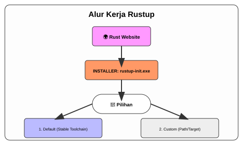

# CH-01_Installing_Rust

> **"Membangun Bengkel Pertama Anda."**

Selamat datang! Sebelum kita bisa menempa pedang dengan Rust, kita perlu membangun bengkelnya terlebih dahulu. Rust bukan hanya sebuah bahasa, tapi sebuah **ekosistem** alat yang bekerja sama untuk menjamin keamanan dan performa kode Anda.

---

## 🔍 Apa itu "Installing Rust"?

**Instalasi Rust** adalah proses menanamkan "alat-alat pertukangan" digital ke dalam sistem operasi Anda. Ini bukan sekadar menyalin file, melainkan mendaftarkan Rust ke dalam jalur perintah (*PATH*) komputer Anda agar ia bisa dipanggil kapan saja untuk mengubah teks menjadi aplikasi nyata.

---

## 🎭 Analogi: "Si Tukang Kayu dan Asistennya"

### 1. Analogi Singkat (The Quick Snap)
Membayangkan **`rustup`** seperti seorang **Asisten Pribadi** yang tidak hanya membawakan tas alat Anda, tetapi juga memastikan setiap gergaji dan palu Anda selalu dalam versi terbaru dan kompatibel satu sama lain. Tanpa asisten ini, Anda harus mencari alat satu per satu di toko yang berbeda.

### 2. Analogi Panjang (The Deep Dive)
Bayangkan Anda ingin membuat furnitur kelas dunia. Di dunia lama, Anda harus pergi ke toko besi (situs web) untuk membeli gergaji (compiler), lalu ke toko lain untuk membeli penggaris (manajer paket), dan seringkali gergaji Anda tidak cocok dengan penggarisnya.

**`rustup`** adalah manajer bengkel Anda. Saat Anda bilang, *"Saya butuh setup untuk kayu jati (Windows/Stable),"* dia akan otomatis mengambilkan set alat yang tepat. Jika besok Anda ingin mencoba kayu mahoni yang sangat baru (Nightly/Beta), dia akan menyiapkan set alat berbeda tanpa mengganggu set alat kayu jati Anda. Dia menjaga agar bengkel tetap rapi, terorganisir, dan siap tempur.

---

## 🛠️ Langkah Instalasi Utama

### 1. Windows: "Pondasi C++"
Rust di Windows membutuhkan *C++ Build Tools*. Ini adalah "tanah" tempat bengkel Rust Anda berdiri.
- Unduh **Visual Studio Build Tools**.
- Pilih beban kerja: *Desktop development with C++*.

### 2. Menginstal `rustup`
Buka terminal dan jalankan perintah sakti:
```powershell
# Jalankan installer yang diunduh dari rustup.rs
./rustup-init.exe
```
Pilih opsi **1 (default)** untuk membiarkan asisten Anda mengatur segalanya secara otomatis.

---

## 🗺️ Visualisasi: Alur Kerja Rustup



---

## 🧪 Verifikasi: "Cek Stok Alat"
Setelah instalasi selesai, pastikan asisten Anda sudah bekerja dengan benar melalui folder `examples/`.

### Contoh Verifikasi:
```bash
rustc --version
cargo --version
```

---
> [!TIP]
> **Pro-Tip**: Jika perintah di atas tidak ditemukan, coba tutup dan buka kembali terminal Anda (refresh PATH).

---
*Kembali ke [Buku](../README.md)*
