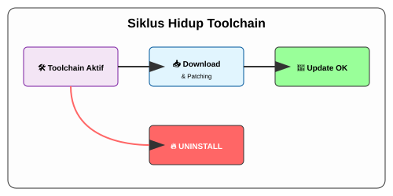

# CH-03_Updates_Uninstall

> **"Merawat dan Membersihkan Bengkel."**

Bengkel yang baik adalah bengkel yang selalu diperbarui alatnya dan bersih dari barang yang sudah tidak terpakai. Rust mempermudah proses pemeliharaan ini dengan satu perintah pusat.

---

## 🎭 Analogi: "Kalibrasi Alat Rutin"

### 1. Analogi Singkat (The Quick Snap)
Pembaruan Rust seperti mengunduh **Update Aplikasi** di smartphone Anda—memperbaiki bug dan menambah fitur baru tanpa harus membeli HP baru.

### 2. Analogi Panjang (The Deep Dive)
Setiap 6 minggu, tim pusat Rust merilis teknologi gergaji dan palu yang lebih presisi. Bayangkan Anda memiliki **Asisten (`rustup`)** yang secara rutin menelepon pabrik. Anda cukup berkata, *"Update stok!"*, dan dia akan mengganti semua alat lama dengan yang baru. 

Jika suatu saat Anda memutuskan untuk berhenti bertukang dan ingin mengubah bengkel menjadi taman bunga, Asisten ini juga yang akan membawa pergi semua alat berat secara bersih tanpa meninggalkan serbuk gergaji di lantai Anda (*Clean Uninstall*).

---

## 🔧 Manajemen Toolchain

### 1. Memperbarui Rust
Cukup jalankan satu perintah ini di terminal mana saja:
```bash
rustup update
```

### 2. Memeriksa Versi Aktif
```bash
rustc --version
```

### 3. Menghapus Seluruh Jejak Rust
Jika Anda ingin menghapus Rust dari sistem secara total:
```bash
rustup self uninstall
```

---

## 🧭 Visualisasi: Siklus Hidup Toolchain



---
> [!TIP]
> **Pro-Tip**: Gunakan `rustup show` untuk melihat daftar semua asisten (toolchain) yang terpasang di sistem Anda.

---
*Kembali ke [Buku](../README.md)*
