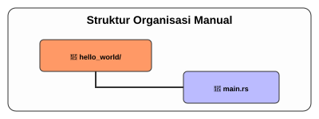

# CH-01_Manual_Environment

> **"Membangun Fondasi dengan Tangan Sendiri."**

Sebelum kita menggunakan "mesin pembuat folder otomatis" (Cargo), kita harus tahu bagaimana melakukannya secara manual. Ini penting agar Anda memahami apa yang terjadi di balik layar dan menghargai bantuan yang diberikan oleh Cargo nantinya.

---

## 🔍 Apa itu "Manual Environment"?

**Persiapan Lingkungan Manual** adalah proses menciptakan struktur rumah bagi kode Anda tanpa menggunakan asisten otomatis. Di sini kita belajar bagaimana menata folder dan file satu per satu agar kita paham "tulang punggung" sebuah proyek Rust sebelum beralih ke otomatisasi.

---

## 🔍 Apa itu "The Entry Point"?

**Titik Masuk** (*Entry Point*) adalah gerbang pertama yang dilewati oleh Sistem Operasi saat menjalankan aplikasi Anda. Tanpa gerbang yang jelas (fungsi `main`), komputer tidak akan tahu dari mana instruksi koding Anda harus mulai dibaca dan dijalankan.

---

## 🎭 Analogi: "Menyiapkan Kanvas Sendiri"

### 1. Analogi Singkat (The Quick Snap)
Menyiapkan folder manual seperti seorang pelukis yang **menghaluskan kanvas** sendiri sebelum mulai melukis. Melelahkan, tapi Anda jadi tahu kualitas serat kainnya secara mendalam.

### 2. Analogi Panjang (The Deep Dive)
Bayangkan Anda ingin membangun sebuah rak buku kayu. 

**Cara Otomatis (Cargo)**: Anda pergi ke IKEA, membeli kotak berisi kayu yang sudah dipotong, baut yang sudah pas, dan manual instruksi. Anda tinggal merakitnya. Cepat, tapi Anda mungkin tidak tahu jenis kayu apa yang digunakan atau bagaimana baut itu menahan beban.

**Cara Manual (CH-01)**: Anda pergi ke toko kayu, memilih papan mentah, mengukurnya dengan penggaris, memotongnya dengan gergaji tangan, dan menyiapkan amplas. Ini adalah proses CH-01. Kita tidak akan langsung "membangun raknya" (menulis kode), tapi kita menyiapkan **meja kerjanya**. Kita membuat folder proyek sendiri, menamainya sesuai aturan, dan menyiapkan file `.rs` kosong. Dengan melakukan ini, Anda menguasai **anatomi dasar** sebuah proyek Rust.

---

## 🛠️ Langkah Praktis: Menyiapkan Folder

Ikuti langkah-langkah ini di terminal Anda untuk menyiapkan "bengkel manual" Anda:

### 1. Buat Direktori Proyek
Pilih nama folder menggunakan **Snake Case** (huruf kecil semua, dipisahkan garis bawah).
```bash
mkdir hello_world
cd hello_world
```

### 2. Buat File Kode Sumber (Source File)
Rust menggunakan ekstensi `.rs`. Untuk program utama, konvensinya adalah menamainya `main.rs`.
```bash
touch main.rs
```

### 3. Struktur Akhir
Pastikan struktur folder Anda terlihat seperti ini:
```text
hello_world/
└── main.rs
```

---

## 🗺️ Visualisasi: Struktur Organisasi Manual



---
> [!IMPORTANT]
> **Kaidah Istilah**: Folder tempat Anda menyimpan file `.rs` sering disebut sebagai **Project Root**. Di sinilah semua aktivitas "pertukangan" manual kita akan berpusat.

---
*Kembali ke [Buku](../README.md)*
