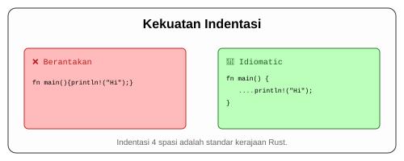

# CH-05_Syntax_Conventions

> **"Etika Menulis di Negeri Rust."**

Bahasa pemrograman bukan hanya soal agar komputer mengerti, tapi juga agar manusia lain (dan Anda di masa depan) bisa mengerti. Rust memiliki aturan "kesantunan" yang sangat dihargai.

---

## 🎭 Analogi: "Aturan Lalu Lintas"

### 1. Analogi Singkat (The Quick Snap)
Konvensi sintaksis seperti **Lampu Lalu Lintas**. Anda bisa saja nekat menerobos lampu merah, tapi itu akan berujung pada kecelakaan (Bug atau kode yang tidak bisa dibaca). Mengikuti aturan membuat perjalanan (Pengembangan) jadi lancar bagi semua orang.

### 2. Analogi Panjang (The Deep Dive)
Bayangkan Anda sedang menulis surat resmi untuk seorang raja. Anda tidak bisa menulisnya sesuka hati. Ada aturan di mana Anda harus meletakkan titik, di mana harus menggunakan huruf kapital, dan berapa banyak spasi yang harus diberikan di awal paragraf agar surat tersebut terlihat profesional.

Di Rust, **Compiler** adalah sang Raja. Dia sangat memperhatikan detail:
- Jika Anda lupa meletakkan **Titik Koma (`;`)**, itu seperti Anda tidak mengakhiri kalimat dengan titik. Raja akan bingung di mana instruksi Anda berakhir.
- Jika Anda tidak menggunakan **Indentasi 4 Spasi**, kode Anda akan terlihat seperti gundukan kata-kata yang tidak beraturan, melelahkan mata sang Raja.
- Jika Anda menamai variabel sesuka hati (tidak menggunakan **snake_case**), Anda melanggar konvensi penamaan resmi kerajaan Rust.

Mengikuti etika ini membuat kode Anda dianggap aseli dan profesional (*Idiomatic Rust*).

---

## 📜 Daftar Konvensi Utama

| Elemen | Aturan | Contoh |
| :--- | :--- | :--- |
| **Pemisah Instruksi** | Wajib menggunakan titik koma `;` | `let x = 5;` |
| **Indentasi** | Wajib 4 Spasi (Jangan pakai Tab!) | (Lihat visualisasi bawah) |
| **Penamaan File** | Lowercase + Underscore (Snake Case) | `hello_world.rs` |
| **Penamaan Fungsi** | Snake Case | `fn hitung_luas() {}` |

---

## 🗺️ Visualisasi: Kekuatan Indentasi

---
> [!TIP]
> **Pro-Tip**: Jangan pusing menghafal indentasi. Gunakan alat **`rustfmt`** (atau tekan 'Format Document' di IDE) agar asisten otomatis merapikan kode Anda sesuai etika kerajaan Rust.

---
*Kembali ke [Buku](../README.md)*
