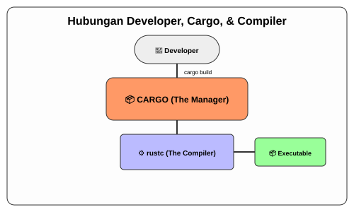

# CH-01_The_Manager

> **"Dari Pekerja Kasar Menjadi Mandor."**

Setelah Anda merasakan bagaimana lelahnya menyiapkan folder dan memanggil compiler secara manual di buku sebelumnya, sekarang saatnya Anda bertemu dengan **Cargo**. Jika Rust adalah "Mesin", maka Cargo adalah "Operator" yang mengurus segala hal remeh-temeh agar Anda fokus pada satu hal saja: Menulis kode.

---

## 🔍 Apa itu "The Manager (Cargo)"?

**Cargo** adalah sistem manajemen paket (*Package Manager*) sekaligus sistem pembangunan (*Build System*) resmi untuk Rust. Dia bertugas mengunduh perpustakaan dari luar (crates), mengompilasi kode Anda, membuat struktur folder standar, dan memastikan semua biner aplikasi Anda terorganisir dengan rapi.

---

## 🎭 Analogi: "Manajer Produksi Film"

### 1. Analogi Singkat (The Quick Snap)
Cargo seperti **Asisten Pribadi** yang selalu siap menyiapkan meja kerja, memesan material, dan memanggil tukang (Compiler) hanya dengan satu instruksi dari Anda.

### 2. Analogi Panjang (The Deep Dive)
Bayangkan Anda adalah seorang **Sutradara Film**.

**Cara Manual (BK-02)**: Anda harus menyiapkan kabel lampu sendiri, mengangkut kamera sendiri, mengatur jadwal katering pemain, dan saat film selesai, Anda sendiri yang harus mencuci rol filmnya satu per satu. Melelahkan dan rawan kesalahan.

**Cara Cargo (BK-03)**: Anda menyewa seorang **Manajer Produksi (Cargo)**. 
- Anda hanya perlu bilang: *"Saya mau buat film baru bernama 'Hello world'!"* dan Cargo langsung menyiapkan studio lengkap dengan struktur folder yang benar.
- Jika Anda butuh efek khusus dari luar, Anda cukup tulis di catatan: *"Saya butuh efek salju"*, dan Cargo akan mencarinya di gudang internasional (crates.io) dan mengantarkannya ke studio Anda.
- Saat syuting selesai, Anda cukup bilang: *"Bungkus!"* (cargo build), dan Cargo akan memanggil semua kru untuk merubah rekaman mentah menjadi film jadi yang siap tayang.

Dengan Cargo, Anda tidak lagi memusingkan "Bagaimana infrastrukturnya dibangun", tapi fokus pada "Apa ceritanya".

---

## 🔍 Kenapa Harus Cargo?

Cargo sangat krusial karena tiga alasan utama:
1.  **Consistency**: Semua orang di dunia menggunakan struktur folder yang sama karena Cargo.
2.  **Ease of Use**: Melakukan update dependencies semudah mengubah satu baris teks.
3.  **Efficiency**: Cargo cerdas; dia hanya akan mengompilasi bagian kode yang berubah saja (*Incremental Compilation*).

---

## 🗺️ Visualisasi: Hubungan Developer, Cargo, & Compiler

---
> [!IMPORTANT]
> **Kaidah Istilah**: Cargo bukan sekadar alat pembantu, dia adalah **Official Build Toolchain**. Di ekosistem Rust, dilarang keras membuat proyek tanpa menggunakan Cargo jika ingin kodenya digunakan oleh orang lain.

---
*Kembali ke [Buku](../README.md)*
