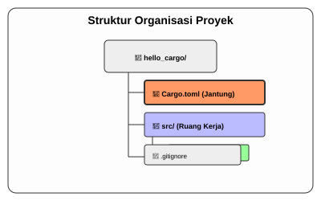

# CH-02_Project_Creation

> **"Membangun Kerangka dengan Sekali Kedip."**

Dalam bab sebelumnya, kita belajar bahwa Cargo adalah sang "Manajer". Sekarang, kita akan melihat bagaimana sang Manajer ini bekerja saat pertama kali kita memintanya membangun "kantor" baru untuk kode kita. Tidak ada lagi pembuatan folder manual atau file kosong; Cargo akan menyiapkan semuanya dengan satu perintah sakti.

---

## 🔍 Apa itu "Project Creation (Cargo New)"?

**Project Creation** di Rust adalah proses inisialisasi lingkungan kerja yang terstandarisasi. Menggunakan perintah `cargo new`, Cargo tidak hanya membuat folder, tetapi juga menyuntikkan "Jantung" proyek (`Cargo.toml`) dan "Ruang Kerja" (`src/`) yang sudah siap pakai. Ini memastikan proyek Anda kompatibel dengan seluruh ekosistem Rust di seluruh dunia.

---

## 🎭 Analogi: "Kontraktor dan Cetak Biru"

### 1. Analogi Singkat (The Quick Snap)
`cargo new` seperti memanggil **Kontraktor Bangunan**. Anda cukup memberikan nama gedung, dan dia akan datang membawa strukturnya, atapnya, dan **Cetak Biru** (Blueprint) yang sudah jadi. Anda tinggal masuk dan mulai menghias (ngoding).

### 2. Analogi Panjang (The Deep Dive)
Bayangkan Anda ingin membuka sebuah **Restoran Baru**.

**Tanpa Cargo (BK-02)**: Anda harus mencari tukang batu, membeli semen sendiri, menggambar denah di atas pasir, dan memastikan pintu depannya tidak terbalik. Melelahkan dan berisiko restorannya ambruk.

**Dengan Cargo (`cargo new`)**: Anda menelepon perusahaan **Franchise (Cargo)**. 
Begitu Anda bilang: *"Saya buka cabang baru bernama 'rust_pizza'!"*, mereka langsung mengirimkan unit bangunan prefabrikasi yang sudah standar:
- **Dapur (`src/`)**: Tempat koki (Anda) bekerja memasak resep. Sudah ada kompor (`main.rs`) yang sudah menyala.
- **Buku Inventaris (`Cargo.toml`)**: Sebuah buku besar di depan restoran yang mencatat siapa pemiliknya, apa nama restorannya, dan bahan baku apa saja yang dipesan dari supplier luar.
- **Pagar Pembatas (`.gitignore`)**: Sebuah instruksi agar tukang sampah tidak mengambil file rahasia dapur Anda saat pembersihan rutin (Git).

Anda tidak perlu lagi pusing membangun tembok; Anda bisa langsung fokus meracik resep pizza (logika program) yang lezat.

---

## 🏗️ Anatomi Proyek Cargo

Saat Anda menjalankan `cargo new hello_cargo`, inilah yang terjadi:

1.  **`Cargo.toml`**: File konfigurasi utama. Di sinilah "identitas" dan "daftar belanja" (dependencies) proyek Anda berada.
2.  **`src/`**: Singkatan dari *Source*. Folder ini adalah **ruang suci** tempat seluruh kode program Anda harus berada. Cargo hanya akan mencari kode di dalam sini.
3.  **`src/main.rs`**: Cargo secara otomatis membuatkan file "Hello World" untuk Anda sebagai awalan.
4.  **`.gitignore`**: Cargo sangat perhatian; dia sudah menyiapkan file ini agar Anda tidak sengaja mengupload sampah kompilasi ke Git.

---

## 🗺️ Visualisasi: Struktur Organisasi Proyek

---
> [!IMPORTANT]
> **Kaidah Istilah**: File **`Cargo.toml`** menggunakan format **TOML** (*Tom's Obvious, Minimal Language*). Ini adalah jantung dari setiap proyek Rust. Jika file ini hilang, Cargo akan kehilangan arah dan tidak tahu cara mengelola proyek Anda.

---
*Kembali ke [Buku](../README.md)*
