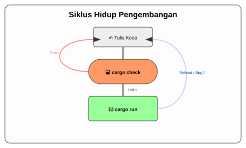

# CH-03_Standard_Workflow

> **"Ritme Kerja Sang Profesional."**

Setelah Anda memiliki "kantor" (proyek), apa yang Anda lakukan sehari-hari? Anda tidak akan terus-menerus membuat proyek baru. Sebagian besar waktu Anda akan dihabiskan untuk menulis kode, memeriksa kesalahan, dan mencoba menjalankannya. Cargo memiliki tiga alat utama yang akan menjadi teman setia Anda dalam siklus ini.

---

## 🔍 Apa itu "Standard Workflow"?

**Alur Kerja Standar** (*Standard Workflow*) adalah siklus berulang yang dilakukan developer saat mengembangkan aplikasi. Di Rust, alur ini sangat efisien karena kita memiliki tiga perintah kunci: `check` untuk kepastian cepat, `build` untuk merakit, dan `run` untuk melihat hasil nyata. Memahami kapan harus menggunakan masing-masing perintah akan meningkatkan produktivitas Anda berkali-kali lipat.

---

## 🎭 Analogi: "Laboratorium Uji Kualitas"

### 1. Analogi Singkat (The Quick Snap)
Workflow Cargo seperti **Proses Memasak**: `check` adalah mencicipi bumbu, `build` adalah mematangkan masakan di oven, dan `run` adalah menyajikannya ke meja makan.

### 2. Analogi Panjang (The Deep Dive)
Bayangkan Anda adalah seorang ilmuwan yang sedang meracik **Ramuan Super**.

- **`cargo check` (Uji Laboratorium)**: Ini adalah asisten lab yang sangat teliti. Dia melihat resep Anda dan mengecek: *"Eh, ini bahan kimianya kalau dicampur meledak tidak?"*. Dia tidak benar-benar mencampur bahannya (tidak membuat file biner), dia hanya memastikan teorinya aman. Ini sangat cepat karena tidak ada proses "pemuainan" yang berat.
- **`cargo build` (Proses Fabrikasi)**: Setelah asisten lab bilang aman, Anda memasukkan bahan-bahannya ke mesin pabrik. Mesin ini bekerja keras memutar, memanaskan, dan mencetak ramuan Anda menjadi sebuah **Botol Cairan** yang siap pakai. Ini butuh waktu lebih lama karena ada wujud fisik (biner) yang diciptakan.
- **`cargo run` (Uji Coba Lapangan)**: Ini adalah saat Anda meminum ramuan tersebut. Perintah ini secara otomatis melakukan `check`, lalu `build` (jika ada perubahan), dan langsung **menjalankan** hasilnya untuk melihat apakah Anda benar-benar jadi pahlawan super atau tidak.

Seorang developer Rust yang cerdas akan memanggil asisten lab (`check`) berkali-kali saat menulis kode, dan baru melakukan fabrikasi (`build/run`) saat sudah yakin teorinya benar.

---

## 🛠️ Tiga Senjata Utama Cargo

### 1. `cargo check` (Paling Sering Digunakan)
Gunakan ini setiap kali Anda selesai menulis beberapa baris kode.
```bash
cargo check
```
*Mengapa?* Sangat cepat karena tidak menghasilkan file biner. Dia hanya memastikan kode Anda valid di mata Compiler.

### 2. `cargo build`
Gunakan ini saat Anda ingin menghasilkan file executable untuk diberikan ke orang lain.
```bash
cargo build
```
*Hasilnya:* File biner akan muncul di folder `target/debug/`.

### 3. `cargo run`
Gunakan ini saat Anda ingin langsung melihat hasil output program Anda di layar.
```bash
cargo run
```
*Tip:* Jika tidak ada perubahan kode sejak build terakhir, Cargo akan langsung menjalankan binernya secara instan tanpa kompilasi ulang.

---



---

## 🧪 Latihan Mandiri: Eksperimen Siklus Cargo

Mari kita praktekkan siklus ini di terminal Anda:

1.  **Check**: Jalankan `cargo check`. Perhatikan betapa cepatnya Cargo memvalidasi kode tanpa membuat file di folder `target/debug`.
2.  **Run**: Jalankan `cargo run`. Cargo akan melakukan kompilasi penuh dan langsung mengeksekusi program.
3.  **Speed Test**: Jalankan `cargo run` sekali lagi tanpa mengubah kode. Perhatikan bahwa program langsung berjalan instan karena Cargo tahu tidak ada perubahan.
4.  **Edit & Check**: Ubah teks di `src/main.rs`, lalu jalankan `cargo check`. Lihtlah bagaimana asisten lab Anda menemukan perubahan tersebut dengan cepat.

---
> [!IMPORTANT]
> **Kaidah Istilah**: Folder **`target/`** adalah tempat Cargo menyimpan semua hasil "fabrikasi" kodenya. Folder ini cenderung berukuran besar, jadi jangan kaget jika struktur proyek Anda tiba-tiba membengkak setelah melakukan `build`.

---
*Kembali ke [Buku](../README.md)*
