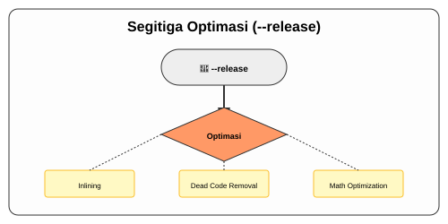

# CH-04_Release_Builds

> **"Melepaskan Kekuatan Tersembunyi."**

Sejauh ini, Anda mungkin merasa Rust sudah cukup cepat. Tapi sebenarnya, selama ini kita bekerja dalam mode "Uji Coba" (Debug). Saat aplikasi Anda siap diterjunkan ke dunia nyata, Cargo memiliki mode khusus yang akan memeras setiap tetes performa dari prosesor Anda.

---

## 🔍 Apa itu "Release Builds"?

**Release Build** adalah proses kompilasi tingkat tinggi di mana Rust Compiler melakukan ribuan optimasi matematis pada kode Anda. Berbeda dengan *Debug Build* yang mengutamakan kecepatan kompilasi dan kemudahan pencarian error, *Release Build* mengutamakan **kecepatan eksekusi** dan **ukuran file** yang efisien.

---

## 🎭 Analogi: "Mobil Prototipe vs Mobil Balap F1"

### 1. Analogi Singkat (The Quick Snap)
*Debug Mode* seperti **Mobil Prototipe** dengan banyak sensor kabel di mana-mana (mudah diperbaiki tapi lambat), sedangkan *Release Mode* adalah **Mobil Balap F1** yang semua kabelnya sudah disembunyikan dan mesinnya sudah disetel untuk kecepatan maksimal.

### 2. Analogi Panjang (The Deep Dive)
Bayangkan Anda sedang membuat sebuah **Patung Marmer**.

**Debug Mode (`cargo build`)**: Anda sedang memahat patung tersebut. Anda memiliki banyak alat bantu: lampu sorot yang sangat terang, tanda coretan pensil di atas marmer untuk menandai kesalahan, dan asisten yang selalu siap mencatat setiap langkah Anda (Inforamsi Debug). Patungnya sudah terlihat, tapi masih penuh dengan coretan dan alat bantu yang menempel. Berat dan lambat untuk dipindahkan.

**Release Mode (`cargo build --release`)**: Ini adalah tahap finishing. Anda menghapus semua coretan pensil, mencabut semua lampu sorot tambahan, dan mengamplas patungnya hingga sangat halus. Asisten Anda pergi, dan semua alat bantu dibuang. 
Hasil akhirnya adalah patung yang **Sangat Ringan, Murni, dan Indah**. 
Memang proses finishing ini (kompilasi) butuh waktu lebih lama, tapi hasil karyanya (binari) jauh lebih portable dan "ngebut" saat dipamerkan kepada publik.

---

## 🛠️ Cara Melepaskan Versi Release

Untuk melakukan optimasi maksimal, gunakan flag `--release`:

```bash
cargo build --release
```

### Apa Perbedan Hasilnya?

| Fitur | Debug Mode | Release Mode |
| :--- | :--- | :--- |
| **Perintah** | `cargo build` | `cargo build --release` |
| **Optimasi** | Minimal (Agar cepat dikompilasi) | Maksimal (Agar cepat dijalankan) |
| **Info Debug** | Lengkap (Mudah di-debug) | Minimal/Tidak ada (File lebih kecil) |
| **Tempat Penyimpanan** | `target/debug/` | `target/release/` |
| **Kecepatan Kompilasi** | Cepat | Lambat |
| **Kecepatan Eksekusi** | Normal | **Sangat Cepat (Nitro)** |

---

## 🗺️ Visualisasi: Segitiga Optimasi



---
> [!WARNING]
> **Peringatan Penting**: Jangan pernah mengukur performa aplikasi Rust Anda (Benchmarking) saat menggunakan mode Debug. Hasilnya akan menyesatkan. Selalu gunakan **`--release`** untuk melihat kekuatan asli Rust!

---
*Kembali ke [Buku](../README.md)*
