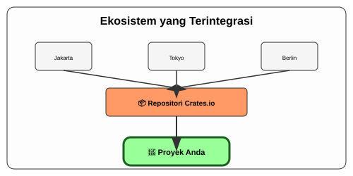

# CH-05_Cargo_Conventions

> **"Bahasa yang Sama di Seluruh Dunia."**

Mengapa programmer Rust dari Jepang, Jerman, dan Indonesia bisa langsung mengerti struktur proyek satu sama lain hanya dalam hitungan detik? Jawabannya bukan karena mereka bicara bahasa yang sama, melainkan karena mereka menggunakan **Konvensi Cargo**.

---

## 🔍 Apa itu "Cargo Conventions"?

**Konvensi Cargo** adalah serangkaian aturan standar tentang bagaimana sebuah proyek Rust harus disusun. Ini mencakup lokasi file kode sumber, cara penamaan proyek, hingga bagaimana file konfigurasi diletakkan. Standarisasi ini adalah "lem" yang merekatkan seluruh komunitas Rust, memungkinkan kolaborasi tanpa gesekan.

---

## 🎭 Analogi: "Suku Cadang Mesin Universal"

### 1. Analogi Singkat (The Quick Snap)
Konvensi Cargo seperti **Ukuran Baut dan Mur Universal**. Karena ukurannya sudah standar di seluruh dunia, Anda bisa membeli baut di manapun dan yakin itu akan pas dengan mesin Anda. Tidak ada lagi "ukuran aneh" yang merusak sistem.

### 2. Analogi Panjang (The Deep Dive)
Bayangkan Anda adalah seorang **Kolektor Mobil Antik**.

**Dunia Tanpa Konvensi**: Setiap merk mobil punya bentuk kunci yang berbeda, lokasi tangki bensin yang tersembunyi, dan ukuran ban yang tidak masuk akal. Jika mobil Anda rusak, Anda harus memanggil mekanik khusus dari pabrik asalnya. Melelahkan dan sangat mahal.

**Dunia Cargo (Rust)**: Seluruh pabrikan mobil (developer) sepakat menggunakan satu standar desain:
- **Kap Mesin (`src/`)**: Selalu berada di depan. Semua mekanik tahu di sinilah mesin utama (kode) berada.
- **Buku Manual (`Cargo.toml`)**: Selalu ada di dalam laci dasbor. Berisi daftar oli dan suku cadang (dependencies) yang dibutuhkan.
- **Hasil Produksi (`target/`)**: Selalu diletakkan di bagasi belakang.

Karena konvensi ini, jika Anda mengunduh kode milik orang lain dari internet, Anda tidak perlu bertanya: *"Di mana file main-nya?"* atau *"Bagaimana cara menjalankannya?"*. Anda cukup masuk ke folder proyek, ketik `cargo run`, dan mesinnya akan menderu seketika. Konvensi ini menghilangkan kebingungan dan memfokuskan energi kita pada **penciptaan**, bukan pada **persiapan**.

---

## 📜 Standard Proyek "Idiomatic"

Agar proyek Anda dianggap profesional, ikuti aturan emas ini:

1.  **Lower Snake Case**: Nama proyek dan file harus menggunakan huruf kecil dan garis bawah (e.g., `my_awesome_project`).
2.  **`src/` is Sacred**: Jangan pernah meletakkan file `.rs` di luar folder `src/` kecuali Anda tahu persis apa yang Anda lakukan.
3.  **No `target/` in Git**: Jangan pernah mengunggah folder `target/` ke repositori pusat. Cargo sudah mengurus `.gitignore` untuk ini.

---

## 🗺️ Visualisasi: Ekosistem yang Terintegrasi

---
> [!TIP]
> **Filosofi Rust**: *"Standard over Configuration"*. Kita lebih memilih struktur yang sudah disepakati bersama daripada menghabiskan waktu berjam-jam hanya untuk mengatur lokasi file. Kedisiplinan ini adalah kekuatan kita.

---
*Kembali ke [Buku](../README.md)*
