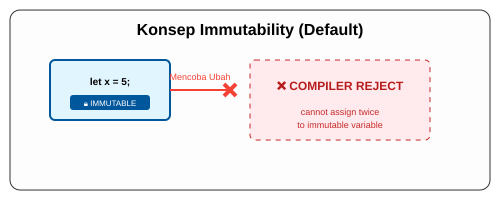

# CH-01_Immutable_Default

> **"Keamanan dalam Ketetapan."**

Di banyak bahasa pemrograman, variabel bisa diubah kapan saja sesuka hati. Di Rust, filosofinya terbalik: Jika Anda memberi nama pada sebuah nilai, nilai itu dianggap **suci dan tidak boleh diubah** secara default. Inilah yang disebut sebagai *Immutability*.

---

## 🔍 Apa itu "Immutable by Default"?

**Immutability** berarti setelah sebuah nilai diikat (*bound*) ke sebuah nama variabel, Anda tidak bisa mengganti nilai tersebut. Jika Anda mencoba menulis ulang isinya, Compiler Rust akan mogok kerja dan memberikan peringatan keras. Ini dilakukan untuk mencegah bug "perubahan data tak terduga" yang sering terjadi di aplikasi besar.

---

## 🎭 Analogi: "Segel Pabrik"

### 1. Analogi Singkat (The Quick Snap)
Variabel di Rust seperti **Foto Cetak**. Sekali foto itu dicetak (variabel dideklarasikan), isinya tidak bisa berubah. Anda tidak bisa tiba-tiba mengubah ekspresi wajah orang dalam foto tersebut. Jika ingin ekspresi berbeda, Anda harus mengambil foto baru (Shadowing) atau menggunakan video (Mut).

### 2. Analogi Panjang (The Deep Dive)
Bayangkan Anda membeli sebuah **Kotak Perkakas (Variabel)** yang memiliki **Segel Pabrik (Immutable)**.

1.  **Pemberian Nama**: Anda menaruh obeng di dalam kotak dan memberi label "Obeng Utama".
2.  **Ketentuan**: Secara default, Rust memberikan "Segel Kawat" pada kotak tersebut. Anda bisa melihat isinya, Anda bisa menggunakannya (membaca nilainya), tapi Anda dilarang keras mengganti obeng tersebut dengan palu.
3.  **Keamanan**: Kenapa segel ini penting? Bayangkan jika Anda memiliki 100 asisten (Fungsi/Thread) yang semuanya mengandalkan "Obeng Utama" tersebut. Jika salah satu asisten diam-diam menggantinya dengan palu tanpa memberitahu yang lain, maka 99 asisten lainnya akan mengalami kecelakaan saat mencoba menggunakannya.
4.  **Hukum Rust**: Dengan menyegel kotak secara default, Rust menjamin bahwa siapa pun yang membaca "Obeng Utama" akan selalu mendapatkan obeng yang sama, selamanya.

---

## 💻 Contoh Kode: Pelanggaran Segel

```rust
fn main() {
    let x = 5;
    println!("Nilai x adalah: {}", x);

    // x = 6; // ❌ ERROR! Tidak bisa mengubah variabel yang tersegel (immutable).
}
```

---

## 🗺️ Visualisasi: Konsep Immutability



---
> [!IMPORTANT]
> **Filosofi Keamanan**: Rust sangat mengutamakan *Safety*. Dengan membuat segalanya tetap secara default, kita mengurangi beban kognitif saat membaca kode karena kita tahu data tersebut tidak akan berubah di baris-baris selanjutnya.

---
*Kembali ke [Buku](../README.md)*
