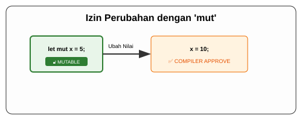

# CH-02_Mut_Keyword

> **"Kunci untuk Gerakan."**

Meskipun Rust mencintai ketetapan (immutability), aplikasi nyata seringkali membutuhkan perubahan. Untuk itulah ada kata kunci **`mut`**. Ini adalah cara Anda memberitahu Rust: *"Saya tahu apa yang saya lakukan, tolong izinkan saya mengubah data ini nanti."*

---

## 🔍 Apa itu Keyword `mut`?

**`mut`** (singkatan dari *mutable*) adalah sebuah pengenal yang Anda tambahkan saat mendeklarasikan variabel. Tanpa `mut`, variabel Anda adalah konstanta di tingkat memori lokal. Dengan `mut`, Anda membuka "izin tulis" pada alamat memori tersebut.

---

## 🎭 Analogi: "Foto vs Video"

### 1. Analogi Singkat (The Quick Snap)
Jika variabel immutable adalah **Foto Cetak**, maka variabel mutable adalah **File Video** di komputer. Anda bisa mengeditnya, memotongnya, atau menimpanya dengan konten baru kapan saja tanpa harus membuang "Bingkai"-nya.

### 2. Analogi Panjang (The Deep Dive)
Bayangkan Anda sedang membuat sebuah **Papan Skor Digital** untuk pertandingan basket.

1.  **Tanpa `mut`**: Papan skor tersebut seperti papan kayu yang dicat. Di awal pertandingan tertulis "0". Begitu skor berubah jadi "2", Anda tidak bisa menghapusnya karena catnya sudah kering. Anda harus membuat papan baru. Tidak efisien.
2.  **Dengan `mut`**: Papan skor tersebut adalah layar LED. Anda mendeklarasikannya sebagai `let mut skor = 0;`. Saat tim mencetak angka, Anda tinggal menekan tombol (memberikan nilai baru) dan layarnya akan berubah menjadi "2" seketika.
3.  **Kesepakatan**: Rust membolehkan ini, tapi dia ingin Anda **mengumumkannya di awal**. Dengan menulis `mut`, Anda memberi sinyal kepada pembaca kode lainnya: *"Hati-hati, nilai papan skor ini akan terus berubah selama pertandingan!"*

---

## 💻 Contoh Kode: Kekuatan Perubahan

```rust
fn main() {
    // Menambahkan 'mut' agar x bisa diubah
    let mut x = 5;
    println!("Nilai x awal: {}", x);

    x = 10; // ✅ BERHASIL! Karena x dideklarasikan dengan 'mut'.
    println!("Nilai x setelah diubah: {}", x);
}
```

---

## 🗺️ Visualisasi: Membuka Gerbang Mutability



---
> [!TIP]
> **Kapan Gunakan `mut`?**: Gunakanlah sesedikit mungkin. Jika Anda bisa menyelesaikan masalah tanpa mengubah variabel, itu lebih aman. Namun, jika efisiensi memori sangat penting (misal: memproses data besar di tempat), jangan ragu menggunakan `mut`.

---
*Kembali ke [Buku](../README.md)*
