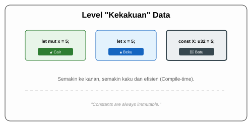

# CH-03_Constants

> **"Abadi Sejak Dalam Pikiran."**

Setelah kita mengenal variabel tetap (immutable) dan variabel yang bisa berubah (mutable), ada satu lagi jenis "penyimpan informasi" yang sangat kaku: **Konstanta (`const`)**.

---

## 🔍 Apa itu Konstanta?

**Konstanta** adalah nilai yang sudah dipastikan tetap dan tidak akan pernah berubah selama program berjalan. Berbeda dengan variabel `let` yang dievaluasi saat program jalan (*at runtime*), konstanta dihitung bahkan saat program sedang dikompilasi (*at compile-time*).

---

## 🎭 Analogi: "Prasasti Batu"

### 1. Analogi Singkat (The Quick Snap)
Konstanta seperti **Angka di KTP** atau **Prasasti Batu**. Sekali diukir, ia tidak bisa dihapus, diganti jubah (shadowing), atau diubah izinnya (mut). Ia ada di sana untuk selamanya sebagai referensi mutlak.

### 2. Analogi Panjang (The Deep Dive)
Bayangkan Anda sedang membangun sebuah **Gedung Pencakar Langit**.

1.  **Variabel Immutable (`let`)**: Seperti **Daftar Penyewa**. Saat ini penyewanya adalah "Budi". Anda tidak berencana menggantinya, tapi nama ini baru ditulis saat gedung sudah beroperasi.
2.  **Variabel Mutable (`let mut`)**: Seperti **Layar Informasi** di lobi. Isinya bisa berubah setiap detik sesuai berita terbaru.
3.  **Konstanta (`const`)**: Seperti **Gravitasi** atau **Titik Koordinat** bumi di mana gedung itu berdiri. Anda tidak perlu menunggu gedung jadi untuk tahu angka gravitasi itu berapa. Angka ini sudah ada bahkan sebelum gedung mulai dibangun (Compile-time). 

Konstanta tidak pernah "bertanya" saat program jalan; ia sudah tertanam permanen di dalam struktur bangunan program Anda.

---

## 📜 Perbedaan Vital: `const` vs `let`

| Fitur | Variable (`let`) | Constant (`const`) |
| :--- | :--- | :--- |
| **Keyword** | `let` atau `let mut` | `const` |
| **Mutable?** | Bisa (pakai `mut`) | **Sama sekali tidak bisa**. |
| **Tipe Data** | Opsional (Bisa tebak otomatis) | **Wajib ditulis eksplisit**. |
| **Shadowing** | Boleh. | **Dilarang keras**. |
| **Scope** | Bisa global atau lokal. | Bisa global atau lokal. |
| **Evaluasi** | Saat program jalan (Runtime). | Saat program dikompilasi (Compile-time). |

---

## 💻 Contoh Kode: Mandat Konstanta

```rust
// Konstanta biasanya ditulis di luar main (global) dengan UPPER_SNAKE_CASE
const TIGA_JAM_DALAM_DETIK: u32 = 60 * 60 * 3;

fn main() {
    println!("Detik dalam 3 jam: {}", TIGA_JAM_DALAM_DETIK);
}
```

---

## 🗺️ Visualisasi: Level "Kekakuan" Data



---
> [!IMPORTANT]
> **Kaidah Penamaan**: Konstanta Rust WAJIB menggunakan huruf kapital semua dengan garis bawah (**`UPPER_SNAKE_CASE`**). Ini memudahkan developer lain mengenali bahwa nilai tersebut adalah "mandat tetap" dari program.

---
*Kembali ke [Buku](../README.md)*
