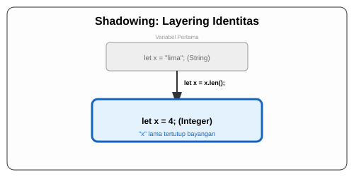

# CH-04_Shadowing_Basics

> **"Membangun di Atas Jejak."**

Apa yang terjadi jika Anda ingin menggunakan nama yang sama untuk data yang sedikit berbeda? Di bahasa lain, Anda mungkin harus membuat nama seperti `pembayaran_str` lalu `pembayaran_int`. Di Rust, ada teknik sakti bernama **Shadowing**.

---

## 🔍 Apa itu Shadowing?

**Shadowing** adalah kemampuan untuk mendeklarasikan variabel baru dengan nama yang *persis sama* dengan variabel yang sudah ada sebelumnya. Variabel kedua akan "membayangi" atau menutupi variabel pertama. Ini bukan mutasi (mengubah isi), melainkan **penimpaan identitas**.

---

## 🎭 Analogi: "Ganti Jubah"

### 1. Analogi Singkat (The Quick Snap)
Shadowing seperti seorang aktor yang **bermain peran**. Aktornya tetap satu (memori), tapi dia berganti kostum. Begitu dia memakai Jubah Raja, penonton (program) melihatnya sebagai Raja. Begitu dia ganti Jubah Pengemis, penonton melihatnya sebagai Pengemis. Namanya di poster tetap sama, tapi karakternya berubah total.

### 2. Analogi Panjang (The Deep Dive)
Bayangkan Anda sedang menulis sebuah **Naskah Identitas**.

1.  **Tahap 1**: Anda menulis `let nama = "Budi";`. Sekarang, setiap kali Anda memanggil "nama", Rust merujuk pada string teks ini.
2.  **Shadowing**: Kemudian Anda butuh menghitung jumlah huruf di nama tersebut. Alih-alih membuat variabel `panjang_nama`, Anda menulis `let nama = nama.len();`.
3.  **Proses**: Rust melihat kata kunci `let` lagi dengan nama yang sama. Ia berkata: *"Oke, variabel 'nama' yang lama sekarang saya sembunyikan di balik bayangan. Mulai sekarang, 'nama' adalah variabel BARU yang berisi angka 4."*
4.  **Keamanan**: Berbeda dengan `mut`, di mana Anda "mengacak-acak" isi kotak, di Shadowing Anda membuang kotak lama dan menaruh kotak baru di tempat yang sama. Ini lebih aman karena variabel tersebut tetap *immutable* setelah di-shadow.

---

## 📜 Shadowing vs Mutability

| Fitur | Mutability (`mut`) | Shadowing (`let`) |
| :--- | :--- | :--- |
| **Konsep** | Mengubah "isi" kotak. | Menumpuk "kotak baru" di atasnya. |
| **Ganti Tipe Data?** | **Dilarang keras**. | **Boleh dan sangat berguna**. |
| **Gaya Penulisan** | `x = x + 1;` | `let x = x + 1;` |
| **Status Akhir** | Variabel tetap mutable. | Variabel tetap immutable (secara default). |

---

## 💻 Contoh Kode: Transformasi Tipe Data

```rust
fn main() {
    let spaces = "   "; // Bertipe &str
    let spaces = spaces.len(); // Shadowing: Sekarang bertipe usize (angka)

    println!("Jumlah spasi: {}", spaces);
}
```

---

## 🗺️ Visualisasi: Layering Identitas



---
> [!IMPORTANT]
> **Kekuatan 'let'**: Shadowing hanya terjadi jika Anda menggunakan kata kunci **`let`** kembali. Jika Anda lupa menulis `let`, Rust akan menganggap Anda mencoba melakukan mutasi biasa, dan jika variabelnya tidak `mut`, maka akan terjadi error.

---
*Kembali ke [Buku](../README.md)*
