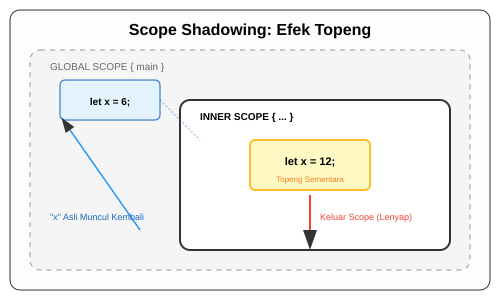

# CH-05_Shadowing_Advanced

> **"Bayangan yang Hilang dan Muncul."**

Setelah kita paham bahwa Shadowing bisa mengubah tipe data, sekarang kita akan masuk ke tingkatan yang lebih dalam: **Shadowing dalam Scope**. Ini adalah tempat di mana Rust menunjukkan kekuatannya dalam mengelola memori secara cerdas tanpa ribet.

---

## 🔍 Apa itu Scope Shadowing?

Di Rust, Anda bisa melakukan shadowing di dalam blok kode yang dibatasi oleh kurung kurawal `{ }`. Variabel yang di-shadow di dalam scope hanya akan "hidup" selama durasi scope tersebut. Begitu program keluar dari scope, variabel tersebut akan "lenyap" dan variabel asli yang ada di luar akan muncul kembali.

---

## 🎭 Analogi: "Topeng Pesta"

### 1. Analogi Singkat (The Quick Snap)
Scope Shadowing seperti seseorang yang memakai **Topeng Pesta** saat masuk ke ruangan tertentu. Di luar ruangan, semua orang mengenalnya sebagai "Tuan X". Di dalam ruangan (Scope), ia memakai topeng "Ksatria". Begitu ia keluar ruangan, ia melepas topengnya dan kembali menjadi "Tuan X" yang sama seperti semula.

### 2. Analogi Panjang (The Deep Dive)
Bayangkan Anda sedang berada di sebuah **Pesta Topeng (Program)**.

1.  **Dunia Luar (Parent Scope)**: Anda memiliki variabel `let status = "Warga Biasa";`.
2.  **Ruang Dansa (Inner Scope)**: Anda masuk ke sebuah pintu `{ }`. Di pintu masuk, Anda memakai jubah dan topeng sebagai `let status = "Pangeran";`. Di dalam ruangan ini, setiap kali orang memanggil "status", Anda menjawab sebagai Pangeran.
3.  **Bayangan**: "Warga Biasa" tetap ada, tapi ia sedang bersembunyi di balik topeng Pangeran.
4.  **Keluar Pintu**: Begitu musik berhenti dan Anda keluar dari pintu `}`, jubah dan topeng Anda harus ditinggalkan di dalam ruangan tersebut. Begitu Anda berada di koridor lagi, Anda kembali menjadi "Warga Biasa".

---

## 🔍 Mengapa Ini Lebih Aman dari Mutability?

Jika Anda menggunakan `mut`, perubahan tersebut bersifat **permanen** bagi variabel tersebut. Jika Anda tidak sengaja mengubah data penting, asisten (fungsi) lain mungkin akan bingung.

Dengan **Shadowing**, Anda tidak pernah benar-benar mengubah data asli. Anda hanya "menumpuk" data baru di atasnya untuk sementara. Data asli tetap aman dan utuh, hanya saja ia sedang tertutup aksesnya. Ini mengurangi risiko kesalahan fatal saat data harus dikelola secara berjenjang.

---

## 💻 Contoh Kode: Eksperimen Scope

```rust
fn main() {
    let x = 5;

    let x = x + 1; // Shadowing pertama: x jadi 6

    {
        let x = x * 2; // Shadowing kedua (Sifatnya LOKAL di scope ini)
        println!("Nilai x di dalam scope: {}", x); // Hasil: 12
    }

    println!("Nilai x di luar scope: {}", x); // Hasil: 6 (Kembali seperti sebelum masuk scope)
}
```

---

## 🗺️ Visualisasi: Efek Topeng Scope



---
> [!TIP]
> **Gunakan Shadowing Jika...**: Anda butuh transformasi data sementara (misal: parsing input atau memformat teks) tanpa ingin mengubah status asli variabel tersebut atau mengotori namespace dengan nama-nama baru.

---
*Kembali ke [Buku](../README.md)*
