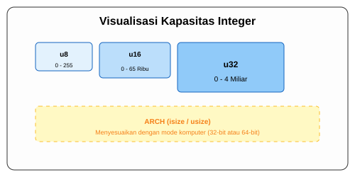

# CH-01_Integer_Types

> **"Menghitung Tanpa Koma, Mengatur Tanpa Batas."**

Bilangan bulat (*Integers*) adalah dasar dari hampir semua logika komputer. Di Rust, pemilihan tipe integer bukan sekadar soal "angka", tapi soal efisiensi memori dan arsitektur mesin.

---

## 🔍 Apa itu Integer di Rust?

**Integer** adalah bilangan bulat tanpa komponen pecahan. Rust membagi integer menjadi dua kategori besar:
1. **Signed (`i`)**: Bisa menyimpan angka positif dan negatif.
2. **Unsigned (`u`)**: Hanya bisa menyimpan angka positif (nol atau lebih).

Setiap kategori memiliki variasi ukuran berdasarkan jumlah bit yang digunakan (8, 16, 32, 64, 128 bit).

---

## 🎭 Analogi: "Kotak Barang Berlabel"

### 1. Analogi Singkat (The Quick Snap)
Memilih tipe integer seperti **Memilih Ukuran Kardus**. Jika Anda hanya ingin menyimpan 10 kelereng, jangan gunakan kontainer kapal (`u128`). Cukup gunakan kotak kecil (`u8`). Jika salah pilih, memori akan terbuang sia-sia atau barangnya tidak muat (Overflow).

### 2. Analogi Panjang (The Deep Dive)
Bayangkan Anda adalah seorang **Manajer Gudang Inventaris**.

1.  **Label `i` (Signed)**: Seperti laci yang bisa menyimpan **Hutang atau Piutang**. Ada tanda plus/minus di depannya. Setengah kapasitas laci untuk angka negatif, setengah lagi untuk positif.
2.  **Label `u` (Unsigned)**: Seperti laci **Stok Barang Fisik**. Barang fisik tidak mungkin berjumlah negatif. Karena tidak perlu menyimpan tanda minus, laci ini bisa menyimpan angka positif dua kali lebih besar dari laci signed dengan ukuran yang sama.
3.  **Ukuran Bit**: Ini adalah ukuran fisik laci Anda.
    *   **8-bit**: Laci mungil (Muat angka 0-255).
    *   **32-bit**: Laci standar (Muat hingga 4 miliar).
    *   **isize/usize**: Laci "Ajaib" yang ukurannya menyesuaikan dengan lebar lantai gudang Anda (Arsitektur komputer 32-bit atau 64-bit).

---

## 📜 Daftar Tipe Integer

| Ukuran | Signed | Unsigned | Rentang (Unsigned) |
| :--- | :--- | :--- | :--- |
| **8-bit** | `i8` | `u8` | 0 - 255 |
| **16-bit** | `i16` | `u16` | 0 - 65,535 |
| **32-bit** | `i32` | `u32` | 0 - 4,294,967,295 |
| **64-bit** | `i64` | `u64` | 0 - 18,446,744,073,709,551,615 |
| **128-bit** | `i128` | `u128` | Sangat besar... |
| **Arch** | `isize` | `usize` | Tergantung Komputer |

---

## 💻 Contoh Kode: Eksperimen Angka

```rust
fn main() {
    // Rust menebak tipe data secara otomatis sebagai i32 (default)
    let angka_bulat = 42; 

    // Mendefinisikan tipe secara eksplisit
    let usia: u8 = 25;
    let populasi: u64 = 8_000_000_000; // Gunakan underscore agar mudah dibaca

    println!("Usia: {}, Populasi: {}", usia, populasi);
}
```

---

## 🗺️ Visualisasi: Memori dan Batas Angka



---
> [!WARNING]
> **Integer Overflow**: Apa yang terjadi jika Anda memasukkan angka 256 ke dalam `u8` (maksimal 255)? Di mode debug, Rust akan **panik** (program berhenti). Di mode release, Rust akan melakukan *wrapping* (kembali ke 0). Selalu pilih ukuran yang aman!

---
*Kembali ke [Buku](../README.md)*
