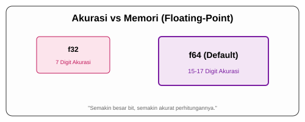

# CH-02_Floating_Point_Types

> **"Akurasi di Balik Koma."**

Setelah angka bulat, kita membutuhkan cara untuk merepresentasikan angka desimal. Di Rust, ini disebut sebagai **Floating-Point Types**.

---

## 🔍 Apa itu Floating-Point?

Tipe ini digunakan untuk angka yang memiliki komponen pecahan (ada komanya). Rust menggunakan standar IEEE-754 untuk merepresentasikan angka-angka ini. Ada dua tipe utama:
1. **`f32`**: Ukuran 32 bit (Single precision).
2. **`f64`**: Ukuran 64 bit (Double precision).

**Default**: Jika variabel desimal dideklarasikan tanpa tipe eksplisit, Rust akan memilih **`f64`** karena pada CPU modern kecepatannya hampir sama dengan `f32` namun memiliki akurasi yang jauh lebih tinggi.

---

## 🎭 Analogi: "Penggaris Ketelitian"

### 1. Analogi Singkat (The Quick Snap)
Memilih antara `f32` dan `f64` seperti memilih antara **Penggaris Kayu (f32)** dan **Jangka Sorong Digital (f64)**. Untuk mengukur panjang meja, penggaris kayu sudah cukup. Tapi untuk mengukur komponen mesin jam tangan, Anda butuh akurasi jangka sorong agar tidak meleset seujung rambut pun.

### 2. Analogi Panjang (The Deep Dive)
Bayangkan Anda adalah seorang **Arsitek Jembatan**.

1.  **Tipe `f32` (Single Precision)**: Seperti membuat sketsa kasar di kertas. Sudah ada gambaran angkanya, tapi jika Anda terus melakukan perhitungan berantai (misal: menghitung beban dari ujung ke ujung), akumulasi "pembulatan kecil" bisa membuat jembatan Anda meleset beberapa sentimeter.
2.  **Tipe `f64` (Double Precision)**: Seperti menggunakan simulasi komputer dengan akurasi hingga mikrometer. Memori yang digunakan memang dua kali lebih besar, tapi "pembulatan" yang terjadi sangat-sangat kecil hingga hampir tidak terasa dalam perhitungan rumit.
3.  **Filosofi Rust**: Rust memilih `f64` sebagai default agar Anda tidak terjebak dalam masalah akurasi (*precision loss*) yang sering menghantui aplikasi sains atau keuangan.

---

## 💻 Contoh Kode: Presisi Desimal

```rust
fn main() {
    let x = 2.0;      // Secara otomatis dianggap f64
    let y: f32 = 3.0; // Dideklarasikan secara eksplisit sebagai f32

    println!("Nilai x (f64): {}", x);
    println!("Nilai y (f32): {}", y);
}
```

---

## 🗺️ Visualisasi: Akurasi vs Memori



---
> [!TIP]
> **Kapan Gunakan `f32`?**: Biasanya hanya digunakan jika Anda memiliki keterbatasan memori yang sangat ketat atau sedang bekerja di perangkat keras khusus (Embedded Systems) yang tidak mendukung pemrosesan 64-bit secara efisien.

---
*Kembali ke [Buku](../README.md)*
