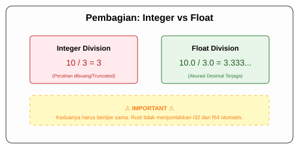

# CH-03_Numeric_Operations

> **"Bahasa Matematika dalam Komputer."**

Setelah memiliki angka (integer dan floating-point), langkah selanjutnya adalah melakukan kalkulasi. Rust mendukung operasi aritmatika dasar yang sudah akrab bagi kita.

---

## 🔍 Operasi Dasar

Rust mendukung operasi standar:
*   **Penjumlahan (+)**
*   **Pengurangan (-)**
*   **Perkalian (*)**
*   **Pembagian (/)**: Ingat, pembagian dua integer akan menghasilkan integer (pecahan dibuang).
*   **Sisa Bagi (%)**: Menghitung sisa dari hasil pembagian.

---

## 🎭 Analogi: "Tim Olahraga Sera-Tipe"

### 1. Analogi Singkat (The Quick Snap)
Operasi numerik di Rust seperti **Tanding Olahraga antar Kelas**. Tim Kelas A (`i32`) tidak boleh bertanding langsung dengan Tim Kelas B (`f64`). Rust sangat disiplin: jika Anda ingin menjumlahkan angka, keduanya HARUS memiliki tipe data yang persis sama. Tidak ada "pencampuran" otomatis yang samar.

### 2. Analogi Panjang (The Deep Dive)
Bayangkan Anda adalah seorang **Koki di Restoran Mewah**.

1.  **Bahan Baku (Tipe Data)**: Anda punya Tepung Terigu (`i32`) dan Mentega Cair (`f64`).
2.  **Aturan Dapur (Type Safety)**: Resep rahasia Rust melarang Anda membuat adonan jika bahannya belum disetarakan. Anda tidak bisa menjumlahkan 5 gram tepung dengan 0.5 liter mentega begitu saja.
3.  **Proses Konversi**: Agar masakan jadi, Anda harus mengubah tepung jadi cair (casting ke `f64`) atau membekukan mentega jadi padat (casting ke `i32`). 
4.  **Hasil**: Dengan aturan ketat ini, Rust menjamin hasil masakan (kalkulasi) Anda tidak memiliki "rasa yang aneh" (kesalahan perhitungan tersembunyi).

---

## 💻 Contoh Kode: Kalkulator Rust

```rust
fn main() {
    // Penjumlahan
    let sum = 5 + 10;

    // Pengurangan
    let difference = 95.5 - 4.3;

    // Perkalian
    let product = 4 * 30;

    // Pembagian
    let quotient = 56.7 / 32.2;
    let truncated = -5 / 3; // Hasilnya -1 (integer division)

    // Sisa Bagi
    let remainder = 43 % 5;

    println!("Sum: {}, Diff: {}, Prod: {}, Quot: {}, Trunc: {}, Rem: {}", 
              sum, difference, product, quotient, truncated, remainder);
}
```

---

## 🗺️ Visualisasi: Pembagian Integer vs Float



---
> [!IMPORTANT]
> **Integer Division**: Banyak pemula terjebak saat membagi `10 / 3` dan mengharap hasil `3.33`. Karena keduanya integer, Rust akan memberikan hasil `3`. Jika ingin hasil desimal, gunakan float: `10.0 / 3.0`.

---
*Kembali ke [Buku](../README.md)*
