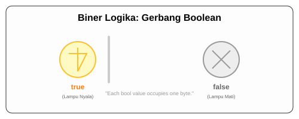

# CH-04_Boolean_Type

> **"Dunia Hitam Putih."**

Dalam logika pemrograman, seringkali kita hanya butuh jawaban: "Ya" atau "Tidak". Inilah peran dari tipe data **Boolean**.

---

## 🔍 Apa itu Boolean?

Tipe data **Boolean** di Rust hanya memiliki dua kemungkinan nilai: **`true`** (benar) atau **`false`** (salah). Tipe ini berukuran 1 byte di memori. Di Rust, penulisan tipenya menggunakan keyword **`bool`**.

---

## 🎭 Analogi: "Saklar Lampu"

### 1. Analogi Singkat (The Quick Snap)
Boolean seperti **Saklar Lampu**. Hanya ada dua kondisi: Menyala (`true`) atau Mati (`false`). Tidak ada kondisi "remang-remang" di antaranya. Jika saklar ditekan, kondisi berubah total.

### 2. Analogi Panjang (The Deep Dive)
Bayangkan Anda adalah seorang **Penjaga Gerbang Mercusuar**.

1.  **Pesan Rahasia (Variabel)**: Anda memiliki lampu mercusuar yang digunakan untuk memberi sinyal ke kapal di tengah laut.
2.  **Kondisi `true`**: Anda menyalakan lampu. Artinya "Aman untuk Merapat". Kapal-kapal bisa melihat cahaya Anda dengan jelas.
3.  **Kondisi `false`**: Anda mematikan lampu. Artinya "Bahaya, Jangan Dekat".
4.  **Logika Keputusan**: Di Rust, boolean sering menjadi "bahan bakar" bagi struktur keputusan (Control Flow). Jika `aman == true`, maka kapal lewat. Jika tidak, kapal menunggu. Sederhana, tegas, dan tanpa keraguan.

---

## 💻 Contoh Kode: Logika Gerbang

```rust
fn main() {
    let t = true;
    let f: bool = false; // Dengan anotasi tipe eksplisit

    println!("Status lampu: {}", t);
    println!("Status bahaya: {}", f);

    // Penggunaan umum: Perbandingan
    let apakah_lima_lebih_besar_dari_tiga = 5 > 3; // Menghasilkan 'true'
    println!("Apakah 5 > 3? {}", apakah_lima_lebih_besar_dari_tiga);
}
```

---

## 🗺️ Visualisasi: Biner Logika



---
> [!TIP]
> **Efisien**: Meskipun secara matematis boolean hanya butuh 1 bit, komputer modern memproses data minimal dalam kelipatan byte. Itulah sebabnya `bool` di Rust memakan 1 byte (8 bit) agar cepat diakses oleh CPU.

---
*Kembali ke [Buku](../README.md)*
