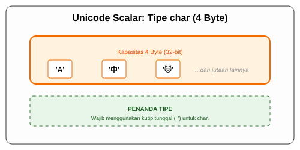

# CH-05_Character_Type

> **"Kekuatan Seribu Simbol."**

Setelah angka dan logika, kita memiliki cara untuk merepresentasikan sebuah karakter tulisan. Di Rust, karakter bukan sekadar kode ASCII, melainkan standar Unicode yang luas.

---

## 🔍 Apa itu Character di Rust?

Tipe data **`char`** di Rust merepresentasikan sebuah nilai scalar Unicode. Ia mampu menyimpan lebih dari sekadar alfabet Latin standar (a-z). Karakter ini berukuran **4 byte** di memori.

**Penulisan**: Di Rust, literal `char` selalu menggunakan tanda kutip tunggal (**`'`**), BUKAN tanda kutip ganda (**`"`**). Jika menggunakan kutip ganda, maka itu dianggap sebagai `String` atau `&str`.

---

## 🎭 Analogi: "Kotak Pos Internasional"

### 1. Analogi Singkat (The Quick Snap)
Tipe `char` seperti **Kotak Pos Internasional**. Ia tidak hanya bisa menerima surat berbahasa Indonesia, tapi juga bisa menerima kartu pos dari Jepang (Emoji), surat dari Rusia (Cyrillic), atau naskah kuno. Kotaknya cukup besar untuk menampung satu simbol dari mana saja di seluruh dunia.

### 2. Analogi Panjang (The Deep Dive)
Bayangkan Anda adalah seorang **Kolektor Perangko Dunia**.

1.  **Buku Koleksi (Memori)**: Anda memiliki album yang setiap slotnya didesain sangat lebar (4 byte).
2.  **Perangko (Unicode)**: Anda bisa menaruh perangko bergambar huruf 'A' di sana. Tapi, slot yang sama juga bisa menampung perangko dari China (Kanji), perangko dari Arab, hingga perangko modern berupa emoji "Kucing Menangis" (😿).
3.  **Kualitas**: Rust menjamin bahwa koleksi Anda tidak akan rusak. Anda tidak bisa memasukkan setengah perangko. Setiap simbol yang Anda simpan pasti valid menurut standar Unicode dunia.

---

## 💻 Contoh Kode: Ekspresi Karakter

```rust
fn main() {
    let c = 'z';
    let z: char = 'ℤ'; // Karakter simbol matematika
    let heart_eye_cat = '😻'; // Emoji!

    println!("Karakter alfabet: {}", c);
    println!("Karakter simbol: {}", z);
    println!("Karakter emoji: {}", heart_eye_cat);
}
```

---

## 🗺️ Visualisasi: Ruang Unicode Rust



---
> [!IMPORTANT]
> **Char vs String**: `char` adalah SATU simbol tunggal yang dikurung `' '`. `String` adalah "kereta api" yang terdiri dari banyak gerbong `char`. Keduanya sangat berbeda di mata Compiler Rust.

---
*Kembali ke [Buku](../README.md)*
