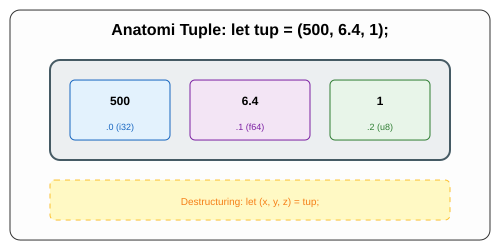

# CH-01_Tuple_Type

> **"Satu Wadah, Beragam Cerita."**

Kadang kita ingin mengelompokkan beberapa nilai yang berbeda menjadi satu kesatuan. Di sinilah **Tuple** menjalankan perannya.

---

## 🔍 Apa itu Tuple?

**Tuple** adalah cara umum untuk mengelompokkan sejumlah nilai dengan berbagai tipe data ke dalam satu tipe compound. 
*   **Panjang Tetap**: Sekali dideklarasikan, jumlah elemen di dalam tuple tidak bisa bertambah atau berkurang.
*   **Tipe Campuran**: Anda bisa menaruh `i32`, `f64`, dan `u8` secara bersamaan di dalam satu tuple.

---

## 🎭 Analogi: "Kotak Bekal (Lunch Box)"

### 1. Analogi Singkat (The Quick Snap)
Tuple seperti **Kotak Bekal** yang memiliki sekat-sekat. Satu sekat berisi nasi (Tipe A), sekat lain berisi ayam (Tipe B), dan sekat kecil berisi sambal (Tipe C). Mereka semua berada dalam satu kotak yang sama, tapi isinya berbeda-beda jenis.

### 2. Analogi Panjang (The Deep Dive)
Bayangkan Anda adalah seorang **Kurir Paket Terpadu**.

1.  **Paket (Tuple)**: Anda membawa satu kotak besar yang berisi:
    *   Sebuah buku (Informasi String).
    *   Satu keping koin emas (Angka Desimal).
    *   Sepucuk surat persetujuan (Boolean).
2.  **Identitas**: Kotak ini dikenal sebagai satu paket kiriman. Anda tidak perlu mengirim tiga kotak terpisah.
3.  **Akses (Indexing)**: Untuk mengambil isinya, Anda harus tahu urutan sekatnya. Sekat ke-0 adalah buku, sekat ke-1 adalah koin. Di Rust, kita menggunakan titik (`.`) untuk membuka sekat ini: `paket.0`, `paket.1`.
4.  **Bongkar Muat (Destructuring)**: Jika Anda ingin mengeluarkan semua isinya sekaligus dan menaruhnya di meja masing-masing, Rust membolehkan Anda melakukan "pembongkaran" instan ke variabel-variabel baru.

---

## 💻 Contoh Kode: Mengelola Tuple

```rust
fn main() {
    // Membuat Tuple
    let tup: (i32, f64, u8) = (500, 6.4, 1);

    // 1. Bongkar Muat (Desturing)
    let (x, y, z) = tup;
    println!("Nilai y adalah: {}", y);

    // 2. Akses Langsung (Indexing)
    let lima_ratus = tup.0;
    let enam_koma_empat = tup.1;

    println!("Sekat 0: {}, Sekat 1: {}", lima_ratus, enam_koma_empat);
}
```

---

## 🗺️ Visualisasi: Struktur Tuple di Memori



---
> [!TIP]
> **Tuple Kosong**: Tuple yang tidak memiliki nilai sama sekali ditulis sebagai `()`. Ini disebut **Unit Type** dan mewakili nilai kosong atau tipe return kosong. Mirip dengan `void` di bahasa lain.

---
*Kembali ke [Buku](../README.md)*
