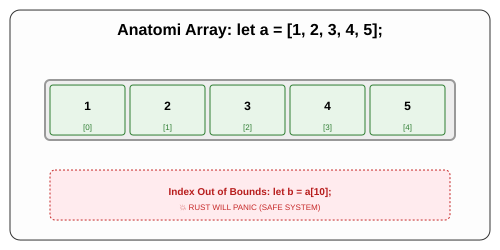

# CH-02_Array_Type

> **"Barisan Seragam yang Terukur."**

Jika Tuple adalah kotak bekal dengan berbagai jenis makanan, maka **Array** adalah sebuah kotak yang berisi deretan benda yang *persis sama* jenisnya.

---

## 🔍 Apa itu Array?

**Array** adalah koleksi dari beberapa nilai dengan tipe data yang **sama**. 
*   **Tipe Seragam**: Jika array bertipe `i32`, maka seluruh isinya harus `i32`.
*   **Panjang Tetap**: Sekali dideklarasikan, jumlah elemennya tidak bisa berubah (sama seperti Tuple).
*   **Stack Allocated**: Array di Rust dialokasikan di *Stack*, bukan *Heap* (Sangat cepat!).

---

## 🎭 Analogi: "Deret Kursi Bioskop"

### 1. Analogi Singkat (The Quick Snap)
Array seperti **Deret Kursi Bioskop**. Jika ada 5 kursi, maka selamanya akan ada 5 kursi (Panjang Tetap). Semua kursi tersebut memiliki bentuk dan fungsi yang sama (Tipe Seragam). Untuk tahu siapa yang duduk, Anda hanya perlu menyebut "Nomor Kursi 0" atau "Nomor Kursi 1" (Indexing).

### 2. Analogi Panjang (The Deep Dive)
Bayangkan Anda adalah seorang **Komandan Upacara**.

1.  **Barisan (Array)**: Anda memiliki satu barisan prajurit yang berjumlah tepat 10 orang.
2.  **Keseragaman**: Semua orang di barisan tersebut harus memakai seragam yang sama (Tipe Data). Anda tidak bisa menyelipkan satu orang berbaju bebas di tengah barisan militer ini.
3.  **Identitas**: Barisan ini dikenal sebagai satu kesatuan. Jika Anda butuh memanggil prajurit tertentu, Anda memanggil indeksnya: "Prajurit ke-0, maju!". (Ingat: Komputer selalu menghitung dari nol).
4.  **Kegunaan**: Array sangat berguna saat Anda memiliki daftar data yang ukurannya sudah pasti dan tidak akan pernah berubah, seperti nama-nama bulan dalam setahun (12 elemen).

---

## 💻 Contoh Kode: Berbaris dalam Array

```rust
fn main() {
    // Membuat Array: [Tipe; Jumlah]
    let a: [i32; 5] = [1, 2, 3, 4, 5];

    // Membuat Array dengan nilai yang sama: [Nilai; Jumlah]
    let b = [3; 5]; // Sama dengan [3, 3, 3, 3, 3]

    // Akses via Index []
    let pertama = a[0];
    let kedua = a[1];

    println!("Pertama: {}, Kedua: {}", pertama, kedua);
}
```

---

## 🗺️ Visualisasi: Struktur Array di Memori



---
> [!CAUTION]
> **Index Out of Bounds**: Jika Anda memiliki array panjang 5, dan Anda mencoba mengakses indeks ke-10 (`a[10]`), Rust tidak akan membiarkannya. Program akan langsung berhenti (*panic*) demi keamanan memori. Ini beda dengan bahasa lain yang mungkin mengembalikan "sampah" atau membuat program crash secara misterius.

---
*Kembali ke [Buku](../README.md)*
