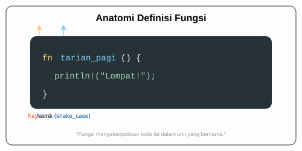

# CH-01_Syntax_and_Naming

> **"Memberi Nama pada Aksi, Menyusun Perintah yang Teratur."**

Di Rust, fungsi adalah tempat kita menyimpan logika agar bisa dipanggil berkali-kali. Memahami sintaks dasar dan aturan penamaannya adalah langkah pertama untuk menulis kode yang bersih (clean code) dan mudah dipahami oleh orang lain.

---

## 🔍 Apa itu Fungsi di Rust?

Fungsi adalah blok kode yang melakukan tugas tertentu. Anda sudah mengenal fungsi `main`, yang merupakan titik masuk (*entry point*) setiap program Rust. Kita menggunakan keyword **`fn`** untuk mendefinisikan fungsi baru.

**Aturan Emas Penamaan**: Rust menggunakan gaya **snake_case** untuk nama fungsi (semua huruf kecil dengan garis bawah sebagai pemisah).

---

## 🎭 Analogi: "Buku Resep Rahasia"

### 1. Analogi Singkat (The Quick Snap)
Mendefinisikan fungsi seperti menulis **Satu Judul Resep** di buku masak. Anda memberi nama "Goreng Telur", menulis langkah-langkahnya di dalam kurung kurawal, dan menyimpannya. Kapanpun lapar, Anda tinggal "memanggil" judul resep tersebut tanpa harus menulis ulang cara memecahkan telur setiap saat.

### 2. Analogi Panjang (The Deep Dive)
Bayangkan Anda adalah seorang **Koreografer Tari**.

1.  **Gerekan Dasar (Kode)**: Anda memiliki gerakan "Lompat", "Putar", dan "Tepuk Tangan". Jika Anda ingin penari melakukannya 10 kali, Anda akan lelah jika harus menjelaskan detail gerakannya setiap saat.
2.  **Nama Tarian (Fungsi)**: Anda membungkus gerakan itu dan memberinya nama `tarian_pagi`. 
3.  **Pemanggilan**: Sekarang, Anda cukup berteriak "Tarian Pagi!". Semua penari sudah tahu apa yang harus dilakukan.
4.  **Fleksibilitas Lokasi**: Hebatnya di Rust, Anda bisa mendefinisikan tarian ini di manapun (di awal atau di akhir naskah). Asalkan naskahnya ada, asisten koreografer (Compiler) akan menemukannya. Rust tidak peduli Anda mendefinisikan fungsi SEBELUM atau SESUDAH fungsi `main`.

---

## 💻 Contoh Kode: Fungsi Pertama Anda

```rust
fn main() {
    println!("Memulai program...");

    // Memanggil fungsi lain
    cetak_salam_hangat(); 
}

// Definisi fungsi baru
// Menggunakan snake_case sesuai konvensi Rust
fn cetak_salam_hangat() {
    println!("Halo dari dalam fungsi! Selamat belajar Rust.");
}
```

---

## 🗺️ Visualisasi: Struktur Definisi Fungsi



---
> [!TIP]
> **Hoisting di Rust**: Tidak seperti beberapa bahasa lain, Rust tidak peduli urutan definisi fungsi Anda. Anda bisa memanggil fungsi `A` di baris ke-5 meskipun fungsi `A` baru didefinisikan di baris ke-100. Rust akan memindai seluruh file sebelum mulai mengompilasi.

---
*Kembali ke [Buku](../README.md)*
