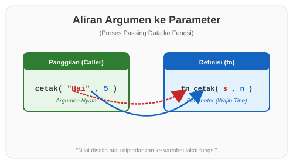

# CH-02_Parameters

> **"Pintu Masuk Informasi: Memberi Data pada Aksi."**

Sebuah fungsi seringkali membutuhkan informasi tambahan untuk bisa bekerja. Di Rust, pintu masuk ini disebut **Parameter**. Tanpa parameter, fungsi akan selalu melakukan hal yang sama persis setiap kali dipanggil.

---

## 🔍 Apa itu Parameters?

**Parameter** adalah variabel khusus yang menjadi bagian dari definisi fungsi. Saat Anda memanggil fungsi tersebut, Anda memberikan nilai nyata (disebut **Argumen**) ke dalam parameter tersebut.

**Aturan Sangat Penting**: Di Rust, Anda **WAJIB** menuliskan tipe data untuk setiap parameter. Rust tidak akan menebak tipe data parameter seperti ia menebak tipe data variabel di dalam fungsi. Ini adalah komitmen keamanan Rust.

---

## 🎭 Analogi: "Mesin Pembuat Kopi Otomatis"

### 1. Analogi Singkat (The Quick Snap)
Parameter seperti **Slot Corong** pada mesin kopi. Anda mendefinisikan bahwa mesin butuh "Biji Kopi" dan "Air". Nilai nyata yang Anda masukkan (misalnya: Biji Arabika dan 200ml Air) adalah argumennya.

### 2. Analogi Panjang (The Deep Dive)
Bayangkan Anda memiliki sebuah **Mesin Penyuara (Voice Machine)**.

1.  **Definisi Mesin (Fungsi)**: Mesin ini dirancang untuk berteriak. Tapi dia tidak tahu harus berteriak apa dan berapa keras.
2.  **Slot Label (Parameter)**: Di panel mesin, ada dua lubang input: satu berlabel `pesan` (tipe: Teks) dan satu berlabel `volume` (tipe: Angka).
3.  **Koin & Kertas (Argumen)**: Saat ingin menggunakannya, Anda memasukkan kertas bertuliskan "BAHAYA" ke lubang pesan, dan memutar knop ke angka "10".
4.  **Eksekusi**: Mesin mengambil data dari lubang input tersebut dan melakukan tugasnya.

Tanpa label tipe data yang jelas di lubang inputnya (Type Annotation), mesin akan bingung jika Anda mencoba memasukkan koin angka ke lubang teks, dan ia akan macet sebelum bekerja (Compile Error).

---

## 💻 Contoh Kode: Parameter dalam Aksi

```rust
fn main() {
    // Memanggil fungsi dengan argumen "Asep" dan 25
    tampilkan_identitas("Asep", 25);
    
    // Memanggil lagi dengan argumen berbeda
    tampilkan_identitas("Siti", 22);
}

// x: &str dan y: i32 adalah parameter
// Kita WAJIB menentukan tipenya
fn tampilkan_identitas(nama: &str, umur: i32) {
    println!("Halo, namaku adalah {nama} dan aku berumur {umur} tahun.");
}
```

---

## 🗺️ Visualisasi: Dari Argumen ke Parameter



---
> [!IMPORTANT]
> **Parameter vs Argumen**: Meskipun sering tertukar, secara teknis:
> - **Parameter**: Variabel yang tertulis di definisi fungsi.
> - **Argumen**: Nilai nyata yang Anda kirim saat memanggil fungsi.

---
*Kembali ke [Buku](../README.md)*
