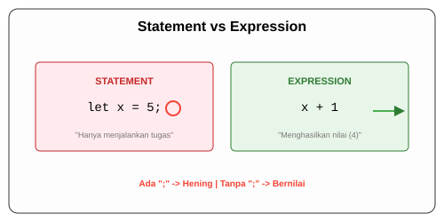

# CH-03_Statements_vs_Expressions

> **"Ritme Bahasa: Antara Perintah dan Nilai."**

Salah satu perbedaan paling mendasar antara Rust dan bahasa lain (seperti C atau Java) adalah statusnya sebagai **Expression-based language**. Memahami perbedaan antara *Statemen* dan *Ekspresi* adalah kunci untuk memahami mengapa Rust sangat ringkas dan kuat.

---

## 🔍 Apa Perbedaannya?

Secara sederhana:
- **Statements (Statemen)**: Adalah instruksi yang melakukan suatu tindakan tetapi **tidak menghasilkan nilai**. (Berakhir dengan titik koma `;`).
- **Expressions (Ekspresi)**: Adalah evaluasi yang **menghasilkan suatu nilai**. (TIDAK berakhir dengan titik koma jika ingin nilainya dikembalikan).

---

## 🎭 Analogi: "Memerintah vs Bertanya"

### 1. Analogi Singkat (The Quick Snap)
**Statemen** seperti seorang Bos yang memberi perintah: *"Tutup pintunya!"*. Pekerjaan selesai, tapi Anda tidak mendapat benda apapun kembali.
**Ekspresi** seperti bertanya: *"Berapa harga kopi ini?"*. Anda mendapat jawaban (nilai) berupa angka "Rp 20.000".

### 2. Analogi Panjang (The Deep Dive)
Bayangkan Anda sedang berada di sebuah **Kantor Pelayanan Publik**.

1.  **Statemen (Setiap Baris Bersemi-kolon)**:
    Anda mengisi formulir (`let x = 5;`). Anda menyerahkannya ke petugas. Petugas mencatatnya. Selesai. Tidak ada yang diberikan kembali ke tangan Anda. Anda tidak bisa menulis `let y = (let x = 5);` karena pengisian formulir bukan sesuatu yang memberikan nilai kembali.

2.  **Ekspresi (Block Tanpa Semi-kolon)**:
    Anda menyerahkan koin ke mesin minuman otomatis. Mesin melakukan proses internal (blok kode `{ ... }`) dan di akhir proses, sebuah kaleng soda **keluar ke tangan Anda**. 
    Di Rust, jika Anda menulis sebaris kode di akhir blok tanpa tanda titik koma, baris itu menjadi "Kaleng Soda" yang dilemparkan keluar dari blok tersebut untuk digunakan oleh variabel lain.

---

## 💻 Contoh Kode: Ekspresi dalam Blok

```rust
fn main() {
    // let y = 6; adalah statemen (tidak ada nilai kembali)
    let y = 6;

    // Blok { ... } adalah sebuah ekspresi yang menghasilkan nilai
    let x = {
        let a = 3;
        a + 1 // TIDAK ADA TITIK KOMA! Ekspresi ini menghasilkan nilai 4
    };

    println!("Nilai x adalah: {x}"); // Hasilnya: 4
}
```

---

## 🗺️ Visualisasi: Penjara Titik Koma



---
> [!IMPORTANT]
> **Hati-hati dengan Titik Koma!**
> Jika Anda menambahkan titik koma di akhir ekspresi, Anda mengubahnya menjadi statemen. Ia tidak lagi menghasilkan nilai, melainkan menghasilkan tipe kosong `()`. Ini adalah sumber kesalahan paling umum bagi pemula di Rust.

---
*Kembali ke [Buku](../README.md)*
