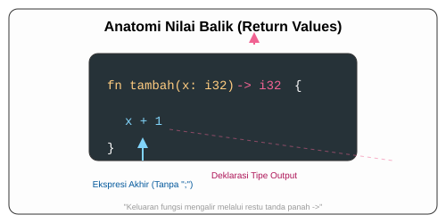

# CH-04_Return_Values

> **"Hasil Akhir: Mengirim Kembali Jawaban."**

Tujuan akhir dari banyak fungsi adalah untuk melakukan perhitungan dan memberikan hasilnya kembali kepada pemanggilnya. Di Rust, cara kita mengembalikan nilai sangat dipengaruhi oleh konsep "Ekspresi" yang telah kita pelajari sebelumnya.

---

## 🔍 Apa itu Return Values?

**Return Value** (Nilai Balik) adalah data yang dihasilkan oleh fungsi setelah selesai bekerja. 

**Aturan Penulisan**:
1.  **Tanda Panah (`->`)**: Anda harus menyatakan tipe data nilai balik setelah tanda panah di definisi fungsi.
2.  **Implicit Return**: Di Rust, baris terakhir sebuah fungsi (tanpa titik koma) secara otomatis dianggap sebagai nilai balik. Ini adalah cara yang lebih disukai (*idiomatic*).
3.  **Keyword `return`**: Tetap bisa digunakan untuk pengembalian dini (*early return*), misalnya di dalam sebuah kondisi `if`.

---

## 🎭 Analogi: "Mesin ATM"

### 1. Analogi Singkat (The Quick Snap)
Fungsi dengan nilai balik seperti **Mesin ATM**. Anda memasukkan kartu (Argumen), mesin bekerja, dan di akhir proses, sebuah "Uang Tunai" (Nilai Balik) **keluar** dari mesin ke tangan Anda.

### 2. Analogi Panjang (The Deep Dive)
Bayangkan Anda memiliki seorang **Asisten Peneliti**.

1.  **Instruksi (Fungsi)**: Anda meminta asisten untuk "Hitung Berapa Jumlah Buku di Perpustakaan".
2.  **Proses (Body)**: Asisten pergi ke perpustakaan, menghitung satu per satu, dan mencatat totalnya di kepalanya.
3.  **Hasil (Return)**:
    - **Pola Rust (Implicit)**: Setelah selesai menghitung, asisten cukup berdiri di depan Anda dan menyebutkan angka "543". Karena itu kata terakhirnya, Anda tahu itu adalah jawabannya.
    - **Pola Lama (Explicit `return`)**: Asisten harus berteriak: *"SAYA MENGEMBALIKAN NILAI: 543!"*. Ini boleh, tapi Rust menganggapnya terlalu bertele-tele jika dilakukan di akhir tugas.

---

## 💻 Contoh Kode: Dua Cara Mengembalikan Nilai

```rust
fn main() {
    let hasil = tambah_lima(10);
    println!("Hasil 10 + 5 adalah: {hasil}");

    let status = cek_kelulusan(85);
    println!("Status Anda: {status}");
}

// 1. Cara Idiomatic (Implicit Return)
// Gunakan -> i32 untuk menyatakan fungsi ini menghasilkan angka
fn tambah_lima(x: i32) -> i32 {
    x + 5 // TANPA TITIK KOMA - Nilai ini dikirim ke pemanggil
}

// 2. Menggunakan keyword 'return' (Explicit)
// Biasanya digunakan untuk kondisi darurat atau keluar lebih awal
fn cek_kelulusan(nilai: i32) -> &'static str {
    if nilai < 60 {
        return "Gagal"; // Keluar lebih awal
    }
    
    "Lulus" // Implicit return untuk jalur normal
}
```

---

## 🗺️ Visualisasi: Keajaiban Tanda Panah



---
> [!IMPORTANT]
> **Tanda Panah Wajib**: Jika fungsi Anda mengembalikan sesuatu, Anda **WAJIB** mencantumkan `-> TipeData`. Jika tidak, Rust akan menganggap fungsi tersebut tidak mengembalikan apa-apa (tipe unit `()`).

---
*Kembali ke [Buku](../README.md)*
