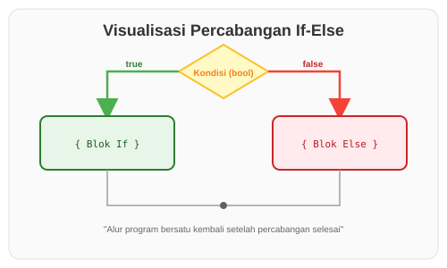

# CH-01_Basic_If_Expressions

> **"Persimpangan Keputusan: Memilih Jalan yang Benar."**

Dalam pemrograman, kita sering kali harus menginstruksikan komputer untuk melakukan sesuatu *hanya jika* kondisi tertentu terpenuhi. Di Rust, alat utama untuk ini adalah ekspresi **`if`**. Berbeda dengan banyak bahasa lain, `if` di Rust bukan sekadar perintah, melainkan sebuah **Ekspresi** yang bisa menghasilkan nilai.

---

## 🔍 Apa itu "if" Expression?

Ekspresi **`if`** memungkinkan Anda untuk mencabangkan kode berdasarkan kondisi logis. Kondisi ini **HARUS** berupa nilai boolean (`true` atau `false`). Rust sangat ketat; ia tidak akan mencoba mengubah angka secara otomatis menjadi boolean (tidak ada konsep *truthy* atau *falsy* seperti di JavaScript atau Python).

---

## 🎭 Analogi: "Penjaga Pintu Klub"

### 1. Analogi Singkat (The Quick Snap)
`if-else` seperti **Saklar Jalur Kereta**. Jika tuas ditarik (`true`), kereta meluncur ke jalur A. Jika tidak (`false`), kereta meluncur ke jalur B. Tidak mungkin kereta melewati kedua jalur sekaligus.

### 2. Analogi Panjang (The Deep Dive)
Bayangkan Anda adalah seorang **Penjaga Pintu** di sebuah gedung olahraga.

1.  **Kondisi (The Check)**: Setiap orang yang datang harus menunjukkan kartu identitas. Aturannya jelas: *"Jika Anda memiliki kartu (true), Anda boleh masuk."*
2.  **Blok Eksekusi (The Action)**: Jika kondisinya terpenuhi, Anda membukakan pintu. Ini adalah blok kode di dalam `{ ... }` pertama.
3.  **Alternatif (The Else)**: Jika orang tersebut tidak punya kartu (`false`), Anda tidak mendiamkannya begitu saja, tapi memberikan instruksi lain: *"Silakan buat kartu di loket sebelah."* Ini adalah blok kode `else`.

Di Rust, asisten penjaga pintu (Compiler) akan memastikan bahwa aturan yang Anda buat sangat logis. Anda tidak boleh memberikan aturan yang ambigu seperti *"Jika Anda lapar (angka 5)"*, karena Compiler akan protes: *"Lapar itu harus 'Ya' atau 'Tidak', saya tidak mengerti angka 5!"*

---

## 💻 Contoh Kode: Logika Dasar If

```rust
fn main() {
    let angka = 7;

    if angka < 10 {
        println!("Kondisinya benar: angka lebih kecil dari 10");
    } else {
        println!("Kondisinya salah: angka 10 atau lebih besar");
    }
}
```

---

## 🗺️ Visualisasi: Percabangan Logika



---
> [!IMPORTANT]
> **Boolean Murni**: Kondisi di dalam `if` harus berupa `bool`. Jika Anda mencoba menulis `if angka { ... }` (di mana `angka` adalah integer), Rust akan memberikan error saat kompilasi. Anda harus menulisnya secara eksplisit, misalnya `if angka != 0 { ... }`.

---
*Kembali ke [Buku](../README.md)*
