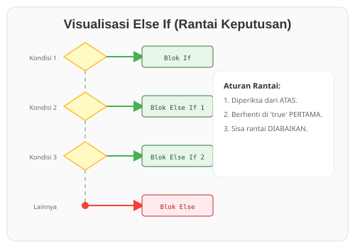

# CH-02_Else_If_Conditions

> **"Pilihan Berlapis: Menangani Banyak Kemungkinan."**

Dunia tidak selalu hanya berisi "Ya" atau "Tidak". Sering kali kita memiliki banyak pilihan atau kondisi yang harus diperiksa secara berurutan. Di Rust, kita menggunakan **`else if`** untuk menyambungkan berbagai kemungkinan hingga menemukan satu yang cocok.

---

## 🔍 Apa itu "else if"?

**`else if`** memungkinkan Anda untuk memeriksa kondisi baru jika kondisi sebelumnya bernilai `false`. Rust akan memeriksa kondisi satu per satu dari atas ke bawah. Segera setelah menemukan kondisi yang `true`, Rust akan menjalankan blok kodenya dan **mengabaikan** sisa kondisi lainnya, meskipun kondisi di bawahnya juga mungkin bernilai `true`.

---

## 🎭 Analogi: "Sistem Kelulusan Ujian"

### 1. Analogi Singkat (The Quick Snap)
`else if` seperti **Tangga Seleksi**. Jika Anda tidak lulus di anak tangga pertama (Nilai A), Anda diperiksa di anak tangga kedua (Nilai B), dan seterusnya. Begitu Anda mendarat di satu anak tangga, Anda tidak perlu lagi melihat anak tangga di bawahnya.

### 2. Analogi Panjang (The Deep Dive)
Bayangkan Anda adalah seorang **Penyortir Buah Otomatis** di pabrik.

1.  **Sensor 1 (If)**: Mesin memeriksa, *"Apakah berat apel > 200g?"*. Jika ya, apel masuk ke kotak "Super".
2.  **Sensor 2 (Else If)**: Jika beratnya tidak > 200g, sensor berikutnya bertanya, *"Apakah berat apel > 150g?"*. Jika ya, apel masuk ke kotak "Sedang".
3.  **Sensor 3 (Else If)**: Jika masih tidak, sensor ketiga bertanya, *"Apakah berat apel > 100g?"*. Jika ya, masuk ke kotak "Kecil".
4.  **Tempat Pembuangan (Else)**: Jika apel sangat kecil dan tidak lolos semua sensor di atas, apel langsung masuk ke kotak "Jus".

Penting untuk diingat: Jika apel seberat 250g lolos di Sensor 1, ia tidak akan pernah diperiksa oleh Sensor 2 atau 3, meskipun 250g juga secara logika lebih besar dari 150g.

---

## 💻 Contoh Kode: Menangani Banyak Kondisi

```rust
fn main() {
    let nilai = 75;

    if nilai >= 90 {
        println!("Grade: A (Luar Biasa)");
    } else if nilai >= 75 {
        println!("Grade: B (Bagus)");
    } else if nilai >= 60 {
        println!("Grade: C (Cukup)");
    } else {
        println!("Grade: D (Perlu Belajar Lagi)");
    }
}
```

---

## 🗺️ Visualisasi: Rantai Keputusan



---
> [!TIP]
> **Gunakan Match?**
> Jika Anda memiliki terlalu banyak `else if` (misalnya lebih dari 3-4), kode Anda mungkin akan terlihat berantakan ("Spaghetti Code"). Di chapter selanjutnya (RAK-03), kita akan mempelajari `match`, alat Rust yang lebih kuat dan bersih untuk menangani banyak kondisi sekaligus.

---
*Kembali ke [Buku](../README.md)*
