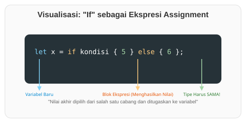

# CH-03_If_in_let_Statements

> **"Kekuatan Ekspresi: Mengubah Keputusan Menjadi Nilai."**

Salah satu fitur paling elegan di Rust adalah kemampuan untuk menggunakan **`if`** di sisi kanan pernyataan `let`. Karena `if` adalah sebuah ekspresi, ia bisa menghasilkan nilai yang langsung dimasukkan ke dalam variabel.

---

## 🔍 Apa itu "if" dalam "let"?

Biasanya, di bahasa lain, Anda mungkin harus membuat variabel kosong dahulu, lalu mengisinya di dalam blok `if`. Di Rust, Anda bisa melakukannya dalam satu baris yang bersih.

**Syarat Utama**:
Setiap cabang (`if` dan `else`) **HARUS** mengembalikan tipe data yang sama. Anda tidak bisa mengembalikan angka di blok `if` dan teks di blok `else`, karena Rust harus tahu pasti apa tipe data variabel tersebut pada saat kompilasi.

---

## 🎭 Analogi: "Mesin Kasir Otomatis"

### 1. Analogi Singkat (The Quick Snap)
`if` dalam `let` seperti **Mesin Vending**. Anda menekan tombol (Kondisi), mesin memproses, dan sebuah kaleng minuman (Nilai) keluar. Anda menangkap kaleng itu dengan tangan Anda (Variabel `let`).

### 2. Analogi Panjang (The Deep Dive)
Bayangkan Anda sedang berada di sebuah **Toko Es Krim**.

1.  **Variabel (`let es_krim`)**: Anda memegang sebuah cup kosong di tangan Anda.
2.  **Kondisi (`if cuaca == "panas"`)**: Anda melihat ke luar jendela.
3.  **Proses**:
    - Jika panas, penjual memberikan Anda "Es Krim Cokelat".
    - Jika tidak panas, penjual memberikan Anda "Es Krim Vanila".
4.  **Hasil Akhir**: Apapun pilihannya, yang masuk ke cup Anda adalah "Es Krim" (Tipe yang sama).

Anda tidak bisa meminta "Es Krim" jika panas, tapi meminta "Sepatu" jika dingin, karena cup Anda hanya dirancang untuk menampung makanan, bukan alas kaki. Compiler Rust adalah pemilik toko yang akan memastikan Anda tidak melakukan permintaan yang mustahil seperti itu.

---

## 💻 Contoh Kode: Assignment dengan If

```rust
fn main() {
    let kondisi = true;

    // Menggunakan if sebagai ekspresi
    let angka = if kondisi { 5 } else { 6 };

    println!("Nilai angka adalah: {angka}");

    // CONTOH SALAH :
    // let result = if kondisi { 5 } else { "enam" }; 
    // ^ Ini akan menyebabkan ERROR karena i32 != &str
}
```

---

## 🗺️ Visualisasi: Penugasan Ekspresif



---
> [!IMPORTANT]
> **Wajib Else**: Saat menggunakan `if` di dalam `let`, Anda **WAJIB** menyertakan blok `else`. Jika tidak, variabel mungkin tidak akan memiliki nilai jika kondisinya `false`, dan Rust tidak mengizinkan variabel yang tidak terinisialisasi.

---
*Kembali ke [Buku](../README.md)*
