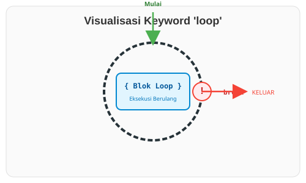

# CH-01_Loop_Keyword

> **"Tekad Tanpa Akhir: Terus Melangkah Hingga Diperintah Berhenti."**

Kadang-kadang, kita butuh kode yang terus berjalan selamanya atau sampai kita menemukan sesuatu yang kita cari. Di Rust, cara paling murni dan efisien untuk melakukan ini adalah dengan keyword **`loop`**.

---

## 🔍 Apa itu "loop"?

Keyword **`loop`** memberitahu Rust untuk menjalankan blok kode berulang-ulang tanpa henti. Berbeda dengan `while` yang punya kondisi di awal, `loop` harus dihentikan secara eksplisit dari dalam blok kodenya menggunakan keyword **`break`**.

**Fitur Unik**:
Rust mengizinkan Anda untuk menyisipkan nilai di sebelah `break` untuk mengembalikan nilai dari perulangan tersebut. Ini membuat `loop` juga bertindak sebagai sebuah ekspresi.

---

## 🎭 Analogi: "Mencari Kunci di Gudang Gelap"

### 1. Analogi Singkat (The Quick Snap)
`loop` seperti **Kincir Angin**. Ia akan terus berputar selama ada angin (energi program), kecuali jika Anda memasukkan pasak besi (`break`) ke dalam rodanya.

### 2. Analogi Panjang (The Deep Dive)
Bayangkan Anda sedang mencari **Kunci Rahasia** di sebuah gudang yang sangat gelap.

1.  **Aksi (`loop`)**: Anda meraba-raba satu kotak, lalu pindah ke kotak berikutnya, lalu berikutnya lagi. Anda tidak tahu ada berapa kotak di sana, jadi Anda tidak bisa merencanakan kapan akan berhenti sejak awal.
2.  **Kondisi Berhenti (`break`)**: Anda bersumpah dalam hati: *"Saya akan terus meraba kotak sampai tangan saya memegang sesuatu yang dingin dan logam."*
3.  **Hasil (`break nilai`)**: Begitu Anda menemukan kunci itu, Anda berteriak, *"DAPAT!"* sambil membawa kunci itu keluar dari gudang. 

Tanpa instruksi untuk berhenti (`break`), Anda akan terjebak di gudang itu selamanya (Infinite Loop), meraba-raba kotak yang sama berkali-kali sampai kelelahan.

---

## 💻 Contoh Kode: Loop dan Nilai Balik

```rust
fn main() {
    let mut penghitung = 0;

    let hasil = loop {
        penghitung += 1;

        if penghitung == 10 {
            // Berhenti dan kirimkan nilai penghitung * 2
            break penghitung * 2;
        }
    };

    println!("Hasil akhir loop adalah: {hasil}"); // Hasilnya: 20
}
```

---

## 🗺️ Visualisasi: Lingkaran Tanpa Akhir (Hampir)



---
> [!TIP]
> **Infinite Loop**: Jika Anda sengaja ingin aplikasi terus berjalan (seperti server yang menunggu koneksi), `loop { ... }` adalah cara yang paling tepat dan hemat resource dibandingkan `while true`.

---
*Kembali ke [Buku](../README.md)*
