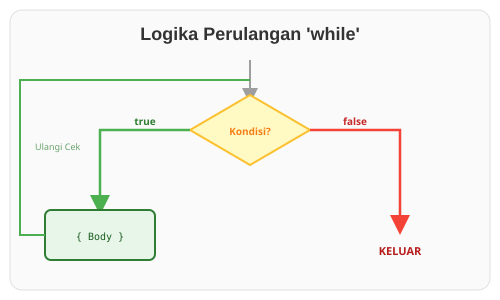

# CH-02_While_Loops

> **"Perulangan Bersyarat: Melangkah Selama Jalan Masih Aman."**

Sering kali kita tidak ingin mengulang sesuatu selamanya, melainkan hanya selama sebuah kondisi tertentu masih benar (`true`). Di situlah **`while`** loop masuk sebagai solusi yang lebih terstruktur daripada `loop` manual.

---

## 🔍 Apa itu "while"?

Perulangan **`while`** memeriksa kondisi di awal setiap putaran.
- Jika kondisi `true`: Jalankan blok kode, lalu kembali ke atas untuk cek lagi.
- Jika kondisi `false`: Langsung keluar dari perulangan dan lanjut ke baris kode berikutnya.

Ini sangat berguna untuk kasus di mana Anda tahu kondisi berhentinya sebelum perulangan dimulai.

---

## 🎭 Analogi: "Tangga yang Licin"

### 1. Analogi Singkat (The Quick Snap)
`while` seperti **Lampu Lalu Lintas**. Selama lampu berwarna hijau (`true`), kendaraan terus melaju. Begitu lampu berubah merah (`false`), semua kendaraan berhenti seketika.

### 2. Analogi Panjang (The Deep Dive)
Bayangkan Anda sedang menaiki sebuah **Tangga yang Sangat Panjang** di tengah hujan.

1.  **Cek Awal (Kondisi)**: Sebelum melangkah, Anda bertanya: *"Apakah anak tangga berikutnya aman dan tidak licin?"*
2.  **Aksi (Body)**: Jika jawabannya "Ya" (`true`), Anda melangkah naik.
3.  **Pengulangan**: Setelah sampai di anak tangga baru, Anda berhenti sejenak dan bertanya lagi pertanyaan yang sama.
4.  **Berhenti**: Begitu Anda melihat anak tangga yang sangat licin atau rusak (`false`), Anda tidak melangkah lagi. Anda berdiri di sana atau turun kembali.

Perbedaan dengan `loop` adalah pada `while`, Anda melakukan **verifikasi keamanan di setiap anak tangga** sebelum kaki Anda menyentuhnya. Jika dari awal tangganya sudah licin, Anda bahkan tidak akan pernah melangkah satu kali pun.

---

## 💻 Contoh Kode: Menghitung Mundur

```rust
fn main() {
    let mut nomor = 3;

    // Selama nomor tidak sama dengan 0
    while nomor != 0 {
        println!("{nomor}...");

        nomor -= 1; // Kurangi nomor di setiap putaran
    }

    println!("MELUNCUR!!! 🚀");
}
```

---

## 🗺️ Visualisasi: Gerbang Pemeriksaan



---
> [!CAUTION]
> **Hati-hati: Infinite Loop!**
> Jika Anda lupa mengubah nilai yang menjadi syarat di dalam `while` (misalnya lupa melakukan `nomor -= 1`), kondisi akan selalu `true` dan program Anda tidak akan pernah berhenti.

---
*Kembali ke [Buku](../README.md)*
