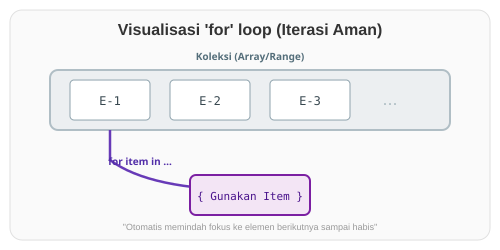

# CH-03_For_Loops

> **"Koleksi Data: Melangkah dengan Aman di Setiap Elemen."**

Meskipun `while` sangat berguna, ada cara yang lebih aman, lebih ringkas, dan lebih populer di komunitas Rust untuk melakukan perulangan pada sekumpulan data (seperti Array). Itulah **`for`** loop.

---

## 🔍 Apa itu "for" loop?

Perulangan **`for`** di Rust digunakan untuk melakukan iterasi (pengulangan) pada setiap elemen dalam sebuah koleksi. Rust menjamin bahwa Anda tidak akan pernah melangkah keluar dari batas data (seperti mengakses indeks ke-10 pada array yang hanya punya 5 elemen), karena `for` menangani teknisnya secara otomatis.

---

## 🎭 Analogi: "Kereta Barang"

### 1. Analogi Singkat (The Quick Snap)
`for` loop seperti **Konveyor Sushi Berjalan**. Anda tidak perlu berjalan mencari sushi; Anda cukup duduk diam dan mengambil setiap piring yang lewat di depan Anda satu per satu sampai koki berhenti meletakkannya.

### 2. Analogi Panjang (The Deep Dive)
Bayangkan Anda adalah seorang **Pemeriksa Tiket** di sebuah Stasiun Kereta.

1.  **Koleksi (The Train)**: Kereta datang dengan deretan gerbong yang tersambung rapi. Anda tahu pasti di mana awal dan akhir kereta tersebut.
2.  **Iterasi (`for gerbong in kereta`)**: Anda mulai dari gerbong paling depan. Anda memeriksa tiket di sana, lalu otomatis pindah ke gerbong berikutnya.
3.  **Keamanan**: Anda tidak perlu menghitung manual, *"Sekarang saya di gerbong nomor berapa?"*. Anda cukup mengikuti sambungan gerbongnya. Anda tidak akan pernah tersesat ke rel kosong di belakang kereta karena `for` loop tahu kapan gerbong terakhir sudah selesai diperiksa.

Dibandingkan dengan `while` (di mana Anda harus membawa peta dan penggaris manual), `for` loop memberikan Anda **pemandu otomatis** yang memastikan Anda memeriksa setiap gerbong dengan urutan yang benar tanpa risiko jatuh dari peron.

---

## 💻 Contoh Kode: Iterasi Array dan Range

```rust
fn main() {
    let daftar_nama = ["Asep", "Budi", "Siti"];

    // Mengiterasi setiap elemen dalam array
    for nama in daftar_nama {
        println!("Halo, {}!", nama);
    }

    println!("---");

    // Menggunakan Range (1 sampai 3, angka 4 tidak termasuk)
    // .rev() digunakan untuk membalik urutan
    for nomor in (1..4).rev() {
        println!("{}...", nomor);
    }
    println!("MELUNCUR!!! 🚀");
}
```

---

## 🗺️ Visualisasi: Konveyor Data



---
> [!TIP]
> **Gunakan `for` sesering mungkin!**
> Di Rust, `for` loop jauh lebih disukai daripada `while` untuk mengiterasi data karena ia menghilangkan risiko error "Off-by-one" (kurang atau kelebihan satu hitungan) yang sering menghantui pemrogram.

---
*Kembali ke [Buku](../README.md)*
