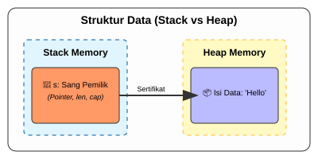
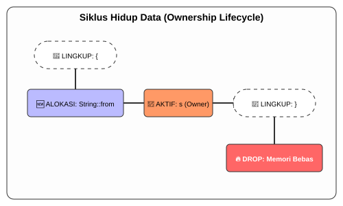

# CH-01_The_Concept

> **"Kedaulatan Data dalam Memori."**

Selamat datang di jantung pertahanan Rust. Jika bahasa lain menggunakan "Pembersih Otomatis" (Garbage Collector) atau membiarkan Anda mengelola memori sendiri (Manual), Rust memilih jalan ketiga: **Ownership**. Ini adalah konsep yang akan mengubah cara Anda memandang data di komputer selamanya.

---

## 🔍 Apa itu "The Concept of Ownership"?

**Ownership** (Kepemilikan) adalah fitur unik Rust untuk mengelola memori. Alih-alih membiarkan data mengambang tanpa pengawasan, Rust memberikan "Pemilik" yang jelas pada setiap bagian data. Saat pemiliknya pergi, datanya pun ikut dihapus. Hal ini menjamin keamanan memori tanpa beban tambahan (*runtime cost*) seperti pada bahasa lainnya.

---

## 🎭 Analogi: "Pemegang Saham dan Aset Perusahaan"

### 1. Analogi Singkat (The Quick Snap)
Ownership seperti **Tongkat Estafet**. Hanya satu orang yang boleh memegang tongkat itu pada satu waktu. Jika dia memberikannya kepada orang lain, dia tidak boleh lagi mengaku-ngaku sebagai pemegangnya. Jika pelari terakhir selesai, tongkatnya disimpan (dihapus).

### 2. Analogi Panjang (The Deep Dive)
Bayangkan Anda adalah seorang **Investor** di sebuah perusahaan properti.

Setiap rumah (Data di Memori) harus memiliki **Sertifikat Kepemilikan (Owner)** yang sah.
1.  **Hanya Satu Pemilik**: Tidak boleh ada dua orang yang memegang sertifikat asli untuk satu rumah yang sama. Ini mencegah keributan (Data Race) tentang siapa yang berhak mengubah cat rumah tersebut.
2.  **Pemindahan Sertifikat**: Jika Anda menjual rumah tersebut (Move), sertifikatnya Anda berikan ke pembeli. Anda sekarang tidak punya hak lagi masuk ke rumah itu. Jika Anda nekat masuk (menggunakan variabel lama), satpam (Compiler) akan langsung menangkap Anda.
3.  **Lelang Saat Pemilik Pergi**: Saat pemilik rumah dinyatakan tidak lagi menjadi investor (Keluar dari Scope/Jangkauan), perusahaan secara otomatis merobohkan rumah tersebut (Free memory) untuk membangun gedung baru. Tidak ada rumah yang terbengkalai (Memory Leak).

Dengan sistem ini, pemerintah (Operating System) tidak perlu repot berkeliling mencari rumah kosong untuk dibersihkan, karena sistem sertifikat ini sudah menjamin setiap jengkal tanah dikelola atau dibersihkan secara otomatis oleh aturannya sendiri.

---

## 🔍 Kenapa Kita Butuh Ownership?

Di bahasa lain, sering terjadi masalah:
- **Dangling Pointers**: Anda mencoba menunjuk ke rumah yang sudah dirobohkan.
- **Double Free**: Anda mencoba merobohkan rumah yang sama dua kali.
- **Memory Leaks**: Rumah dibiarkan berdiri padahal pemiliknya sudah tidak ada di dunia itu.

Ownership menyelesaikan ketiganya sekaligus di tingkat **Kompilasi**, bukan saat program berjalan. Artinya, program Anda akan secepat C++ tapi seaman Java.

---

## 🗺️ Visualisasi: Model Mental Ownership

### 1. Struktur Data (Stack vs Heap)
Sebelum memahami *Ownership*, kita harus melihat bagaimana Rust menyimpan data. Variabel "Pemilik" ada di **Stack**, sedangkan data besarnya ada di **Heap**.

### 2. Siklus Hidup Data
Berikut adalah alur bagaimana Rust mengelola hidup dan matinya sebuah data:

---
> [!IMPORTANT]
> **Kaidah Istilah**: Konsep ini disebut **Zero-Cost Abstraction**. Artinya, Anda mendapatkan keamanan memori tingkat tinggi tanpa harus membayar dengan performa program yang lambat.

---
*Kembali ke [Buku](../README.md)*
