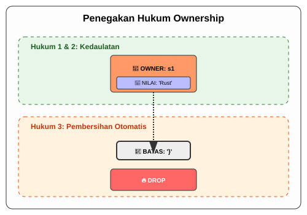

# CH-02_Ownership_Rules

> **"Tiga Hukum Emas yang Menjaga Kestabilan."**

Ownership bukan sekadar ide, ia adalah sistem hukum yang ketat. Jika Anda mengikuti aturannya, program Anda dijamin tidak akan pernah mengalami kebocoran memori atau error segfault yang menakutkan. Di bab ini, kita akan membedah tiga hukum utama yang mendasari segala sesuatu di Rust.

---

## 🔍 Apa itu "Ownership Rules"?

**Aturan Kepemilikan** (*Ownership Rules*) adalah sekumpulan kendala logis yang diterapkan oleh Compiler Rust selama proses pemeriksaan kode. Berbeda dengan bahasa lain yang mengecek memori saat program berjalan (*Runtime*), Rust mengecek aturan ini saat Anda mengompilasi kode. Jika dilanggar, kode tidak akan pernah menjadi file `.exe`.

---

## 🎭 Analogi: "Brankas Berlian dengan Satu Kunci"

### 1. Analogi Singkat (The Quick Snap)
Ownership Rules seperti **Hukum Fisika**: Anda tidak bisa berada di dua tempat sekaligus, dan sebuah kunci asli hanya bisa dipegang oleh satu orang di satu waktu.

### 2. Analogi Panjang (The Deep Dive)
Bayangkan ada sebuah **Brankas Berlian (Data)** yang sangat berharga di sebuah gedung.

1.  **Setiap Berlian punya SATU Pemilik**: Tidak boleh ada dua orang yang mengaku memiliki berlian yang sama. Hanya ada satu identitas (Variabel) yang sah sebagai pemilik berlian tersebut.
2.  **Hanya SATU Pemilik dalam SATU Waktu**: Anda bisa memberikan kuncinya ke orang lain, tapi begitu kunci diberikan, Anda tidak lagi punya akses. Anda tidak bisa menduplikasi kunci bratnkas tersebut secara sembarangan.
3.  **Jika Pemilik Pergi, Berlian Dikandangkan**: Di setiap ruangan (Scope) ada sensor. Jika pemilik kunci keluar dari ruangan dan tidak memberikannya ke siapa pun, sistem keamanan akan menganggap berlian itu tidak lagi dibutuhkan dan akan langsung mengamankannya kembali ke bawah tanah (Memori dihapus).

---

## 📜 Tiga Hukum Emas Ownership

Inilah teks asli dari hukum tersebut yang harus Anda hafal di luar kepala:

1.  **Setiap nilai (value) di Rust memiliki variabel yang disebut pemiliknya (owner).**
2.  **Hanya boleh ada satu pemilik dalam satu waktu.**
3.  **Ketika pemilik keluar dari jangkauan (scope), nilai tersebut akan dibuang (dropped).**

---

## 🗺️ Visualisasi: Penegakan Hukum Ownership

---
> [!IMPORTANT]
> **Kaidah Istilah**: Proses penghapusan memori otomatis di akhir scope disebut **`drop`**. Di bahasa C, Anda harus memanggil `free()` secara manual. Di Rust, Compiler memanggil `drop` untuk Anda tepat setelah variabel tidak lagi digunakan.

---
*Kembali ke [Buku](../README.md)*
