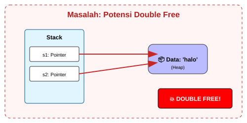
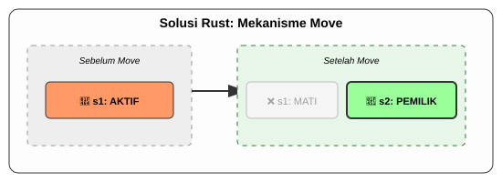

# CH-03_The_Move_Mechanics

> **"Bukan Fotokopi, Tapi Serah Terima Jabatan."**

Di bahasa programming lain, saat Anda melakukan `y = x`, komputer biasanya membuat salinan data `x` ke `y`. Di Rust, terutama untuk data yang disimpan di **Heap** (seperti `String`), perilakunya sangat berbeda. Rust melakukan apa yang disebut sebagai **Move** (Perpindahan). Inilah rahasia di balik efisiensi luar biasa Rust.

---

## 🔍 Apa itu "Move Mechanics"?

**Mekanisme Move** adalah proses pemindahan kepemilikan data dari satu variabel ke variabel lain. Saat data "pindah", pemilik lama secara otomatis menjadi tidak valid. Hal ini dilakukan untuk mencegah masalah **Double Free**—situasi di mana dua variabel mencoba menghapus bagian memori yang sama saat mereka keluar dari scope.

---

## 🎭 Analogi: "Lelang Sertifikat Tanah"

### 1. Analogi Singkat (The Quick Snap)
Move seperti **Memberikan Kunci Rumah Asli**. Begitu kunci Anda berikan ke orang lain, Anda tidak lagi bisa membuka pintu rumah itu. Anda bukan lagi pemiliknya.

### 2. Analogi Panjang (The Deep Dive)
Bayangkan Anda memiliki sebuah **Aset Properti (Data di Heap)** yang besar.

**Cara Bahasa Lain (Deep Copy)**: Setiap kali ada investor baru, perusahaan membangun rumah yang identik persis di tanah sebelah. Melelahkan, memakan tempat, dan lambat jika rumahnya sangat besar.

**Cara Rust (Move)**: Anda hanya memindahkan **Sertifikat Hak Milik (Pointer)**.
1.  **Sertifikat Awal**: Anda memegang sertifikat untuk rumah No. 10.
2.  **Transaksi (`let y = x`)**: Anda memberikan sertifikat asli tersebut kepada Teman Anda. 
3.  **Dampak Instan**: Sekarang, Teman Anda adalah pemilik sah rumah No. 10. Anda tidak punya hak lagi masuk ke sana. Jika Anda mencoba menggunakan nama Anda untuk memesan layanan ke rumah itu, petugas (Compiler) akan berkata: *"Maaf, nama Anda tidak lagi terdaftar sebagai pemilik aset ini."*

Karena hanya sertifikatnya yang pindah (data pointer yang kecil), proses ini sangat cepat, berapa pun besarnya data asli yang ada di dalam rumah tersebut.

---

## 💻 Contoh Kode: Kejutan bagi Pemula

```rust
fn main() {
    let s1 = String::from("halo");
    let s2 = s1; // MOVE TERJADI DI SINI

    // println!("{}", s1); // ❌ ERROR! s1 sudah tidak valid.
    println!("{}", s2);    // ✅ Berhasil. s2 adalah pemilik baru.
}
```

---

## 🗺️ Visualisasi: Perpindahan Kepemilikan (Move)

### 1. Masalah: Potensi Double Free (Skenario Error)
Jika Rust membiarkan `s1` dan `s2` memiliki data yang sama, komputer akan bingung siapa yang harus menghapus data tersebut.



### 2. Solusi Rust: Mekanisme Move
Rust "mematikan" pemilik lama untuk menjamin keamanan.



---
> [!TIP]
> **Kenapa Rust tidak membuat copy saja?** 
> Membuat salinan data di Heap (Deep Copy) sangat memakan performa jika datanya besar. Rust memilih **efisiensi sebagai default**. Jika Anda benar-benar butuh salinan, Anda harus memanggil `.clone()` secara eksplisit.

---
*Kembali ke [Buku](../README.md)*
