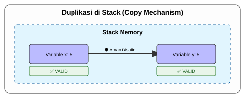

# CH-04_Copy_Types

> **"Katalog Murah yang Bisa Diduplikasi."**

Jika di Bab sebelumnya kita belajar bahwa data besar di **Heap** (seperti `String`) harus dipindahkan (*Move*), maka di bab ini kita akan belajar tentang pengecualian untuk data kecil di **Stack**. Di sini, Rust melakukan apa yang disebut **Copy**.

---

## 🔍 Apa itu "Copy Types"?

**Copy Types** adalah tipe data yang nilainya disimpan sepenuhnya di dalam **Stack**. Karena ukurannya tetap dan murah untuk diduplikasi, Rust tidak merasa perlu untuk memindahkan kepemilikannya. Alih-alih memindahkan, Rust cukup membuat salinan bit-per-bit dari nilai aslinya. Variabel lama tetap valid dan bisa digunakan.

---

## 🎭 Analogi: "Fotokopi KTP"

### 1. Analogi Singkat (The Quick Snap)
Copy seperti **Memfotokopi KTP**. Anda memberikan salinannya ke orang lain, tapi Anda tetap memegang kartu aslinya di dompet. Keduanya valid dan bisa digunakan.

### 2. Analogi Panjang (The Deep Dive)
Bayangkan Anda memiliki sebuah **Katalog Menu Restoran (Data di Stack)** yang dicetak di kertas tipis.

1.  **Murah dan Cepat**: Karena katalog ini ringan, jika ada pelanggan baru yang datang, Anda tidak perlu memberikan katalog asli milik Anda. Anda cukup melakukan **Fotokopi Cepat**.
2.  **Dua-duanya Valid**: Sekarang ada dua katalog yang identik. Anda punya satu, pelanggan punya satu. Jika Anda mencoret menu di katalog Anda, katalog pelanggan tidak berubah.
3.  **Dampaknya**: Tidak ada "Sertifikat Pemilik Tunggal" yang harus diperebutkan di sini. Ukurannya sangat kecil sehingga menduplikasinya jauh lebih cerdas daripada harus mencatat siapa yang memegang sertifikat aslinya.

Dalam Rust, tipe dasar seperti integer (`i32`), boolean (`bool`), dan karakter (`char`) masuk dalam kategori ini.

---

## 💻 Contoh Kode: Tanpa Error

```rust
fn main() {
    let x = 5;
    let y = x; // COPY TERJADI DI SINI

    println!("x = {}, y = {}", x, y); // ✅ Berhasil! x tetap valid.
}
```

---

## 🗺️ Visualisasi: Penggandaan Data (Copy)

### 1. Duplikasi di Stack
Karena datanya kecil, Rust menduplikasi seluruh isinya tanpa mematikan pemilik lama.



### 2. Move vs Copy (Perbandingan)
| Karakteristik | Move (String) | Copy (Integer) |
| :--- | :--- | :--- |
| **Lokasi Data** | Heap | Stack |
| **Variabel Lama** | Mati (Invalid) | Hidup (Valid) |
| **Alasan** | Efisiensi & Keamanan | Kecepatan & Kesederhanaan |

---
> [!IMPORTANT]
> **Kaidah Istilah**: Tipe data yang bisa diduplikasi secara otomatis disebut memiliki **`Copy` Trait**. Jika sebuah tipe data (seperti `String`) memiliki bagian di Heap, ia **tidak boleh** memiliki `Copy` Trait, karena hal itu akan memancing masalah keamanan memori (*Double Free*).

---
*Kembali ke [Buku](../README.md)*
