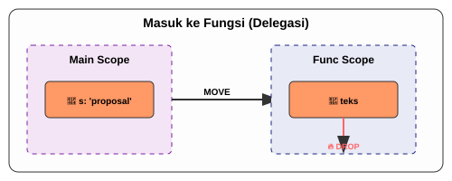
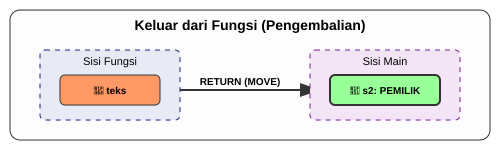

# CH-05_Functions_Ownership

> **"Delegasi Tugas dan Pengembalian Aset."**

Apa yang terjadi saat Anda mengirim sebuah variabel ke dalam fungsi? Apakah variabel itu "pergi" selamanya, atau dia akan "pulang" kembali kepada Anda? Di bab terakhir dari Buku Ownership ini, kita akan melihat bagaimana aturan Ownership berinteraksi dengan **Fungsi**.

---

## 🔍 Apa itu "Ownership in Functions"?

Mengirim nilai ke sebuah fungsi memiliki mekanisme yang sama persis dengan memberikan nilai ke variabel lain (seperti yang kita pelajari di Bab `Move` dan `Copy`). Bergantung pada tipe datanya, nilai tersebut akan **Pindah (Move)** atau **Disalin (Copy)** ke dalam parameter fungsi tersebut.

---

## 🎭 Analogi: "Delegasi Tugas Kantor"

### 1. Analogi Singkat (The Quick Snap)
Mengirim data ke fungsi seperti **Memberikan Berkas ke Rekan Kerja**. Jika berkas itu asli, Anda tidak lagi memilikinya kecuali dia memberikannya kembali kepada Anda.

### 2. Analogi Panjang (The Deep Dive)
Bayangkan Anda adalah seorang **Manajer Proyek (Main Function)**.

1.  **Mengirim Aset (Passing Argument)**: Anda memiliki sebuah **Proposal Proyek (Data String)**. Anda memberikannya kepada **Sekretaris (Fungsi)** untuk diperiksa. Karena Proposal itu cuma ada satu yang asli, begitu Anda berikan, Proposal itu sekarang ada di meja Sekretaris. Anda tidak bisa lagi membacanya di meja Anda.
2.  **Penyelesaian Tugas (End of Function)**: Setelah selesai, Sekretaris menutup foldernya. Jika dia tidak memberikan kembali Proposal itu kepada Anda, maka Proposal itu akan dianggap selesai dan **Dihancurkan (Drop)** oleh sistem arsip kantor.
3.  **Pengembalian Aset (Return Value)**: Jika Anda ingin Proposal itu kembali, Sekretaris harus secara eksplisit **Memberikannya Kembali** lewat pintu keluar (Return). Sekarang, Anda memegang kepemilikan Proposal itu lagi.

Tetapi, jika asetnya hanyalah sebuah **Memo Kecil (Data Integer)**, Anda cukup memberikan **Fotokopi Memo** tersebut. Anda tetap punya aslinya, dan Sekretaris punya salinannya. Keduanya tidak saling mengganggu.

---

## 💻 Contoh Kode: Serah Terima

```rust
fn main() {
    let s = String::from("proposal"); // s punya ownership
    ambil_kepemilikan(s);             // s PINDAH ke fungsi
    // println!("{}", s);             // ❌ ERROR! s sudah tidak valid

    let x = 10;                       // x punya ownership (i32)
    buat_salinan(x);                  // x DISALIN ke fungsi
    println!("x masih ada: {}", x);    // ✅ Berhasil! x tetap valid
}

fn ambil_kepemilikan(teks: String) {
    println!("Menerima: {}", teks);
} // teks di-DROP di sini

fn buat_salinan(angka: i32) {
    println!("Angka: {}", angka);
}
```

---

## 🗺️ Visualisasi: Aliran Kepemilikan dalam Fungsi

### 1. Masuk ke Fungsi (Delegasi)
Menunjukkan bagaimana `s` berpindah ke `teks` dan akhirnya di-drop.



### 2. Keluar dari Fungsi (Pengembalian)
Kadang kita ingin data "pulang" kembali ke pemanggilnya.



---
> [!TIP]
> **Pola "Titip-Balik"**: Seringkali kita hanya ingin fungsi membaca data tanpa mengambil alih kepemilikannya. Melakukan `Move` lalu `Return` terus-menerus sangat merepotkan. Inilah alasan mengapa di Buku selanjutnya kita akan belajar tentang **Borrowing** (Peminjaman).

---
*Kembali ke [Buku](../README.md)*
