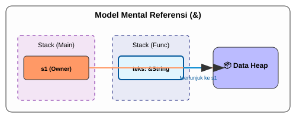

# CH-01_References_Borrowing

> **"Mengamati Tanpa Memiliki."**

Di buku sebelumnya, kita belajar bahwa mengirim data ke fungsi akan memindahkan (*Move*) kepemilikannya. Ini merepotkan jika kita hanya ingin fungsi itu membaca data saja. Rust memberikan solusi elegan: **References** (Referensi) dan **Borrowing** (Peminjaman).

---

## 🔍 Apa itu "Borrowing"?

**Borrowing** adalah aksi membuat referensi ke sebuah nilai tanpa mengambil alih kepemilikannya. Secara teknis, referensi adalah pointer yang merujuk ke memori yang dimiliki oleh variabel lain. Karena tidak memiliki data tersebut, referensi tidak akan men-drop data tersebut saat referensi itu sendiri keluar dari scope.

---

## 🎭 Analogi: "Buku Perpustakaan"

### 1. Analogi Singkat (The Quick Snap)
Borrowing seperti **Meminjam Buku Perpustakaan**. Anda bisa membacanya, mencatat isinya, tapi Anda tidak boleh merobek halamannya (karena itu bukan milik Anda) dan Anda harus mengembalikannya saat selesai.

### 2. Analogi Panjang (The Deep Dive)
Bayangkan Anda memiliki sebuah **Ensiklopedia Langka (Data)**.

1.  **Kepemilikan Mandiri (Ownership)**: Anda adalah pemilik buku tersebut. Jika Anda memberikannya ke teman secara permanen, Anda tidak punya buku lagi.
2.  **Peminjaman (Borrowing)**: Teman Anda ingin tahu isi halaman 45. Alih-alih memberikan bukunya, Anda membiarkan dia **Melihat (Reference `&`)** buku itu sementara. 
3.  **Dampak**: Teman Anda memegang "alamat" di mana buku itu berada. Dia bisa membaca isinya, tapi dia tidak punya hak untuk membakar buku itu. Saat dia selesai membaca, dia cukup pergi. Buku itu tetap ada di meja Anda, aman dan tetap menjadi milik Anda.

Dalam Rust, kita menggunakan tanda ampersand (`&`) untuk menandakan bahwa kita sedang meminjam.

---

## 💻 Contoh Kode: Meminjam dengan Adab

```rust
fn main() {
    let s1 = String::from("halo");

    // Kita mengirim referensi (&s1), bukan s1 itu sendiri
    let len = hitung_panjang(&s1); 

    println!("Panjang '{}' adalah {}.", s1, len); // ✅ s1 masih valid!
}

fn hitung_panjang(teks: &String) -> usize {
    teks.len()
} // teks keluar dari scope, tapi karena ini cuma pinjaman, s1 tidak di-drop.
```

---

## 🗺️ Visualisasi: Model Referensi



---
> [!IMPORTANT]
> **Aturan Default**: Secara default, peminjaman bersifat **berbagi (shared)** dan **hanya-baca (read-only)**. Anda tidak boleh mengubah data yang Anda pinjam dengan `&T`. Untuk mengubahnya, Anda butuh "Izin Khusus" yang akan kita bahas di bab selanjutnya.

---
*Kembali ke [Buku](../README.md)*
