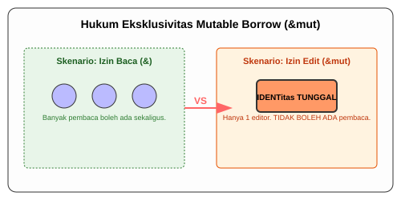

# CH-02_Mutable_References

> **"Satu Pena, Satu Tangan."**

Meminjam data untuk dibaca saja sudah hebat, tapi bagaimana jika kita perlu **mengubah** data tersebut tanpa memindahkannya? Rust mengizinkan ini melalui **Mutable References** (`&mut`), namun dengan batasan yang sangat ketat untuk mencegah kekacauan data.

---

## 🔍 Apa itu "Mutable Reference"?

**Mutable Reference** adalah izin untuk meminjam dan sekaligus memodifikasi sebuah nilai. Namun, ada satu hukum mutlak di Rust: **Anda hanya boleh memiliki SATU referensi mutable untuk sebuah data dalam satu waktu.** 

Kenapa sesadis itu? Untuk mencegah **Data Race**, situasi di mana dua pihak mencoba mengubah data yang sama secara bersamaan, yang bisa merusak isi memori.

---

## 🎭 Analogi: "Izin Edit Dokumen Cloud"

### 1. Analogi Singkat (The Quick Snap)
Mutable Reference seperti **Memberikan Hak Akses Editor** pada dokumen Google Docs. Meskipun banyak orang bisa membacanya (*Shared Reference*), hanya boleh ada satu orang yang mengetik/mengubah isinya pada satu detik yang sama agar teksnya tidak berantakan.

### 2. Analogi Panjang (The Deep Dive)
Bayangkan sebuah **Papan Tulis Proyek (Data)** di sebuah kantor.

1.  **Peminjaman Biasa (`&`)**: Banyak orang boleh berdiri di depan papan tulis untuk membaca jadwal. Tidak masalah jika ada 100 orang yang membaca sekaligus.
2.  **Peminjaman Mutable (`&mut`)**: Jika ada Manajer yang ingin **Mengubah Jadwal**, dia butuh **Spidol Tunggal (Mutable Reference)**.
3.  **Hukum Rust**: Selama Manajer itu memegang spidol dan sedang menulis, **tidak boleh ada orang lain** yang membaca apalagi ikut menulis. Kenapa? Karena saat Manajer menghapus dan menulis ulang, pembaca akan melihat informasi yang "setengah jadi" (inkonsisten).
4.  **Serah Terima**: Begitu Manajer selesai dan meletakkan spidolnya, barulah spidol itu boleh diambil orang lain, atau pembaca boleh kembali melihat papan tersebut.

---

## 💻 Contoh Kode: Konflik yang Dicegah

```rust
fn main() {
    let mut s = String::from("halo");

    {
        let r1 = &mut s;
        r1.push_str(", dunia");
    } // r1 keluar dari scope di sini, aman!

    let r2 = &mut s; // ✅ Berhasil karena r1 sudah tidak ada.
    println!("{}", r2);
}
```

**Skenario Error (Data Race):**
```rust
let mut s = String::from("halo");
let r1 = &mut s;
let r2 = &mut s; // ❌ ERROR! Tidak boleh ada 2 mut pointer sekaligus.

println!("{}, {}", r1, r2);
```

---

## 🗺️ Visualisasi: Penegakan Mutable Borrow



---
> [!IMPORTANT]
> **Larangan Campuran**: Anda tidak boleh memiliki referensi mutable (`&mut`) jika sudah ada referensi read-only (`&`) yang sedang aktif. Pembaca tidak suka jika data yang mereka baca tiba-tiba berubah di bawah hidung mereka!

---
*Kembali ke [Buku](../README.md)*
