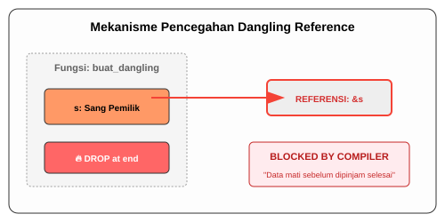

# CH-03_Dangling_References

> **"Menunjuk ke Ruang Hampa."**

Salah satu error paling mematikan di bahasa seperti C++ adalah **Dangling Pointer** (Pointer Gentayangan). Ini terjadi saat Anda memiliki "alamat" memori, tapi data di alamat tersebut sudah dihapus. Mengaksesnya bisa membuat program Anda *crash* atau diretas. Rust menjamin hal ini tidak akan pernah terjadi.

---

## 🔍 Apa itu "Dangling Reference"?

**Dangling Reference** adalah referensi yang merujuk ke lokasi memori yang mungkin sudah diberikan kepada pihak lain atau sudah dibebaskan (dihapus). Di Rust, Compiler menggunakan mekanisme bernama **Lifetime** (Akan dibahas di Buku 03) untuk memastikan bahwa data selalu hidup lebih lama daripada referensi yang menunjuk ke arahnya.

---

## 🎭 Analogi: "Alamat Rumah yang Dirobohkan"

### 1. Analogi Singkat (The Quick Snap)
Dangling Reference seperti **Memegang Kartu Nama Restoran yang Sudah Tutup**. Anda datang ke alamat tersebut, tapi restorannya sudah tidak ada. Anda hanya menemukan puing-puing atau, lebih buruk lagi, gedung baru yang sama sekali berbeda.

### 2. Analogi Panjang (The Deep Dive)
Bayangkan Anda adalah seorang **Kurir (Referensi)** yang diberi catatan alamat pengiriman.

1.  **Pengiriman Normal**: Anda pergi ke alamat No. 10. Rumahnya ada, orangnya ada. Anda memberikan paketnya. Sukses!
2.  **Dangling Scenario**: Anda diberi alamat No. 10. Namun, pemilik rumah (Owner) baru saja pindah dan merobohkan rumah tersebut untuk dijadikan taman umum.
3.  **Bencana**: Jika Anda nekat mencoba meletakkan paket di atas puing-puing itu (mengakses memori), Anda melanggar hukum. 
4.  **Sistem Rust**: Di "Kantor Pusat" Rust, petugas (Compiler) akan mengecek catatan Anda. Jika dia tahu pemilik rumah di No. 10 akan pindah *sebelum* Anda sampai di sana, dia akan **melarang** Anda berangkat. Dia akan berkata: *"Alamat ini akan segera tidak valid, Anda tidak boleh membuat referensi ke sana!"*

---

## 💻 Contoh Kode: Upaya yang Digagalkan

Berikut adalah kode yang mencoba membuat Dangling Reference:

```rust
fn main() {
    let reference_ke_hampa = buat_dangling();
}

fn buat_dangling() -> &String { // ❌ ERROR!
    let s = String::from("halo"); // s hidup di sini

    &s // Kita mencoba mengembalikan referensi ke s
} // s di-DROP di sini. Referensi di atas menunjuk ke 'sampah'.
```

**Pesan Error Rust:**
`this function's return type contains a borrowed value, but there is no value for it to be borrowed from.` 
(Compiler menyadari bahwa `s` akan mati, sehingga memberikan `&s` keluar adalah tindakan ilegal).

---

## 🗺️ Visualisasi: Pencegahan Dangling Pointer



---
> [!TIP]
> **Solusi yang Benar**: Jika Anda ingin mengembalikan data dari fungsi, jangan kembalikan referensinya. Kembalikan **Kepemilikannya** secara langsung (pindahkan String-nya keluar), sehingga data tersebut tetap hidup di tempat baru.

---
*Kembali ke [Buku](../README.md)*
