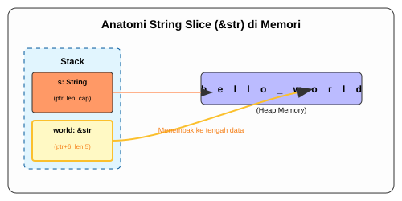

# CH-04_String_Slices

> **"Melihat Sebagian dari Keseluruhan."**

Seringkali kita tidak butuh seluruh teks, melainkan hanya secuil kata di dalamnya. Membuat variabel baru untuk menyimpan secuil kata itu (Copy) sangat boros memori. Rust memperkenalkan **String Slices** (`&str`) sebagai cara untuk merujuk ke bagian tertentu dari sebuah `String`.

---

## 🔍 Apa itu "String Slice"?

**String Slice** adalah referensi ke bagian dari sebuah `String`. Secara teknis, slice menyimpan dua informasi: **Pointer** ke awal potongan data dan **Panjang (Length)** potongan tersebut. Karena slice adalah referensi, ia tunduk pada aturan *Borrowing* yang sudah kita pelajari.

---

## 🎭 Analogi: "Lensa Zoom Kamera"

### 1. Analogi Singkat (The Quick Snap)
String Slice seperti **Zoom Kamera**. Anda tidak membelah objek fotografinya, Anda hanya mengatur lensa untuk fokus melihat area tertentu saja. Objeknya tetap utuh, tapi hasil jepretan Anda hanya berisi bagian yang di-zoom.

### 2. Analogi Panjang (The Deep Dive)
Bayangkan ada sebuah **Papan Iklan Raksasa (String)** di pinggir jalan yang bertuliskan: `"SELAMAT DATANG DI RUST"`.

1.  **Kepemilikan (`String`)**: Anda adalah pemilik papan iklan tersebut. Seluruh plat besi dan catnya adalah milik Anda.
2.  **Pemotongan (Slice `&str`)**: Seseorang ingin mengambil foto kata `"DATANG"` saja.
3.  **Proses**: Orang tersebut tidak merobek papan iklan Anda. Dia hanya mengarahkan **Kamera (Slice)**, mengatur titik awal (indeks kata "D") dan titik akhir (indeks kata "G").
4.  **Hasil**: Di layar kamera (Variabel Slice), yang terlihat hanyalah `"DATANG"`. Kamera itu menunjuk ke papan iklan asli Anda. Jika papan iklan itu Anda turunkan (Drop), maka kamera tersebut tidak bisa lagi mengambil gambar (Dangling Reference).

---

## 💻 Contoh Kode: Membidik Kata

```rust
fn main() {
    let s = String::from("hello world");

    let hello = &s[0..5]; // Slice dari indeks 0 sampai 4
    let world = &s[6..11]; // Slice dari indeks 6 sampai 10

    println!("{} {}", hello, world);
}
```

---

## 🗺️ Visualisasi: Struktur Slice di Memori



---
> [!IMPORTANT]
> **Kaidah Istilah**: Tipe data literal seperti `let s = "halo";` sebenarnya adalah sebuah **String Slice (`&str`)** yang menunjuk langsung ke biner program. Inilah alasan mengapa literal string bersifat *immutable* secara default!

---
*Kembali ke [Buku](../README.md)*
