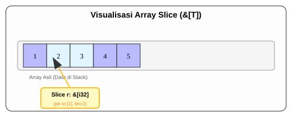

# CH-05_Other_Slices

> **"Satu Adonan, Banyak Potongan."**

Konsep Slice tidak hanya terbatas pada teks (`String`). Kita bisa menggunakan mekanisme yang sama untuk tipe koleksi lain, seperti **Array**. Ini memungkinkan kita bekerja dengan subset data dari koleksi apa pun secara efisien.

---

## 🔍 Apa itu "General Slices"?

**General Slice** adalah referensi ke urutan elemen yang berurutan dalam sebuah koleksi. Tipenya biasanya ditulis sebagai `&[T]`, di mana `T` adalah tipe elemen di dalamnya. Sama seperti String Slice, ia menyimpan **Pointer** ke elemen pertama dan **Panjang** potongan tersebut.

---

## 🎭 Analogi: "Potongan Pizza"

### 1. Analogi Singkat (The Quick Snap)
General Slice seperti **Memutar Loyang Pizza**. Pizzanya satu loyang penuh, tapi Anda hanya mengambil 2 potongan. Anda tidak perlu membuat pizza baru, Anda cukup mengambil bagian yang sudah ada.

### 2. Analogi Panjang (The Deep Dive)
Bayangkan sebuah **Loyang Pizza (Array)** yang sudah dipotong menjadi 8 bagian sama besar.

1.  **Koleksi Utuh (Array)**: Seluruh loyang pizza adalah data Anda. Isinya tetap dan ukurannya sudah pasti (misal: 8 potong).
2.  **Peminjaman Slice (`&[T]`)**: Seorang teman bertanya, *"Boleh saya minta potongan nomor 3 sampai 5?"*. 
3.  **Proses**: Anda tidak memindahkan pizza itu ke piring baru (Copy). Anda hanya menunjukkan: *"Ini, ambillah dari sini (Indeks 2) sampai sini (Langkah 3)"*.
4.  **Efisiensi**: Teman Anda bisa menikmati subset pizza tersebut tanpa Anda harus membuat adonan baru. Begitu dia kenyang (Scope selesai), dia pergi, dan sisa pizza di loyang tetap menjadi milik Anda.

---

## 💻 Contoh Kode: Mengiris Angka

```rust
fn main() {
    let a = [1, 2, 3, 4, 5];

    let slice = &a[1..3]; // Mengambil [2, 3]

    assert_eq!(slice, &[2, 3]);
    println!("Slice: {:?}", slice);
}
```

---

## 🗺️ Visualisasi: Array Slice di Memori



---
> [!TIP]
> **Fleksibilitas Function**: Menggunakan slice sebagai parameter fungsi (misal: `fn proses(data: &[i32])`) jauh lebih fleksibel daripada menggunakan Array tetap (`fn proses(data: [i32; 5])`). Fungsi Anda nantinya bisa menerima Array dengan ukuran berapa pun!

---
*Kembali ke [Buku](../README.md)*
