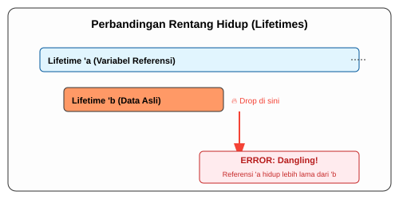

# CH-01_Lifecycle_Concept

> **"Keselarasan Antara Referensi dan Realita."**

Di bab sebelumnya, kita sudah berkenalan dengan *Dangling References*—masalah di mana referensi hidup lebih lama daripada datanya. **Lifetimes** adalah alat yang digunakan Compiler Rust (melalui *Borrow Checker*) untuk memastikan hal itu tidak pernah terjadi secara matematis.

---

## 🔍 Apa itu "Lifetime"?

Setiap referensi di Rust memiliki **Lifetime** (Rentang Hidup), yaitu cakupan (*scope*) di mana referensi tersebut valid untuk digunakan. Sebagian besar waktu, compiler bisa menebak lifetime secara otomatis (*Lifetime Elision*), namun terkadang kita harus membantu compiler saat hubungan antar data menjadi rumit.

---

## 🎭 Analogi: "Sertifikat Garansi Produk"

### 1. Analogi Singkat (The Quick Snap)
Lifetime seperti **Kartu Garansi**. Garansi (Referensi) hanya berguna jika Produknya (Data) masih ada. Jika Anda punya kartu garansi untuk HP yang sudah dihancurkan, kartu itu tidak punya nilai apa pun. Rust memastikan garansi Anda tidak akan pernah kedaluwarsa sebelum produknya rusak.

### 2. Analogi Panjang (The Deep Dive)
Bayangkan Anda membeli sebuah **Mesin Kopi (Data)** yang memiliki **Sertifikat Garansi (Referensi)**.

1.  **Masa Hidup Produk**: Mesin kopi dirancang untuk bertahan selama 5 tahun (Scope Data).
2.  **Masa Berlaku Garansi**: Sertifikat garansi diberikan untuk 2 tahun (Lifetime Referensi).
3.  **Hukum Keselarasan**: Selama masa garansi (2 tahun), mesin kopinya **harus ada**. Jika di tahun pertama mesin kopinya dicuri atau meledak (Data di-drop), maka garansi Anda menjadi *Dangling*.
4.  **Tugas Borrow Checker**: Compiler Rust bertindak sebagai "Manajer Toko" yang ketat. Dia tidak akan mengizinkan Anda menggunakan garansi jika dia melihat kemungkinan mesin kopinya sudah tidak ada di toko tersebut pada saat garansi diaktifkan.

Intinya: **Referensi (&) tidak boleh hidup lebih lama dari pemilik aslinya.**

---

## 💻 Contoh Kode: Visualisasi Scope

```rust
fn main() {
    let r;                // ---------+-- 'a (Lifetime r dimulai)
                          //          |
    {                     //          |
        let x = 5;        // ----+-- 'b  (Lifetime x dimulai)
        r = &x;           //     |    |
    }                     // ----+------- x di-drop di sini
                          //          |
    // println!("r: {}", r); // ❌ ERROR! r digunakan tapi x sudah mati.
}                         // ---------+-- 'a berakhir
```

Dalam kode di atas, `'b` (hidup x) lebih pendek dari `'a` (hidup r). Rust menolak ini karena r akan menjadi referensi gentayangan.

---

## 🗺️ Visualisasi: Overlapping Scopes



---
> [!IMPORTANT]
> **Tujuan Lifetimes**: Lifetimes adalah cara Rust menjamin keselamatan memori tanpa *Garbage Collector*. Jika compiler bisa membuktikan bahwa referensi akan selalu valid, maka program Anda aman dari *segfaults*.

---
*Kembali ke [Buku](../README.md)*
