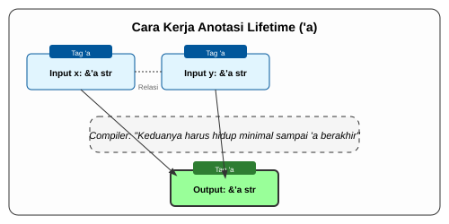

# CH-02_Lifetime_Annotations

> **"Menghubungkan Benang-Benang Waktu."**

Terkadang, compiler Rust tidak bisa menebak sendiri hubungan lifetime antar referensi, terutama saat sebuah fungsi menerima banyak referensi dan mengembalikan salah satunya. Di sinilah kita butuh **Lifetime Annotations** (Anotasi Lifetime) seperti `'a`.

---

## 🔍 Apa itu "Lifetime Annotation"?

**Lifetime Annotation** adalah sintaks khusus (dimulai dengan tanda kutip tunggal, contoh: `'a`) yang digunakan untuk memberitahu compiler: *"Dua atau lebih referensi ini memiliki rentang hidup yang saling berkaitan."*

PENTING: Anotasi ini **tidak mengubah** berapa lama data hidup. Ia hanya **menjelaskan** hubungan tersebut sehingga Compiler bisa memverifikasi keamanan memori.

---

## 🎭 Analogi: "Stempel Paspor yang Terhubung"

### 1. Analogi Singkat (The Quick Snap)
Lifetime Annotation seperti **Tag Warna pada Kunci**. Jika Anda punya dua kunci (Referensi) dengan tag warna merah (`'a`), itu berarti kedua kunci tersebut harus dikembalikan ke resepsionis (selesai digunakan) pada waktu yang sama atau sebelum pemilik aslinya pergi.

### 2. Analogi Panjang (The Deep Dive)
Bayangkan Anda adalah seorang **Petugas Imigrasi (Compiler)**. Ada dua turis, **Alice (Data 1)** dan **Bob (Data 2)**, yang masuk ke negara Anda. Di belakang mereka ada seorang **Pemandu Wisata (Fungsi)**.

1.  **Masalah**: Pemandu wisata berkata: *"Saya akan membawa Alice dan Bob berkeliling, lalu saya akan membawa kembali salah satu dari mereka ke kantor Anda."*
2.  **Kecemasan Petugas**: Anda bingung. Jika Pemandu membawa Alice kembali, tapi Alice sudah harus pulang ke negaranya lebih awal dari Bob, maka Pemandu akan membawa "orang hilang".
3.  **Solusi (`'a`)**: Anda memberikan **Stempel Paspor Bertanda 'A'** kepada Alice, Bob, dan Pemandu. 
4.  **Artinya**: Stempel 'A' berarti: *"Siapa pun yang saya bawa kembali, dia harus berasal dari grup yang masa tinggalnya masih berlaku."* Pemandu dilarang membawa kembali seseorang yang masa tinggalnya lebih pendek dari masa tugas si Pemandu.

---

## 💻 Contoh Kode: Fungsi Terpanjang

```rust
// Kita memberitahu Rust: "Nilai yang dikembalikan hidup selama 'a,
// di mana 'a adalah umur terpendek antara x dan y."
fn terpanjang<'a>(x: &'a str, y: &'a str) -> &'a str {
    if x.len() > y.len() {
        x
    } else {
        y
    }
}

fn main() {
    let s1 = String::from("pendek");
    let result;
    {
        let s2 = String::from("sangat panjang");
        result = terpanjang(s1.as_str(), s2.as_str());
        println!("Hasil: {}", result); // ✅ Berhasil!
    } 
    // println!("{}", result); // ❌ ERROR! result merujuk ke s2 yang sudah mati.
}
```

---

## 🗺️ Visualisasi: Kontrak Antar Referensi



---
> [!TIP]
> **Lifetime Elision**: Rust memiliki aturan cerdas bernama *Elision Rules*. Jika pola kalsifikasinya sederhana (seperti fungsi dengan satu input), Rust akan memasang `'a` secara otomatis di balik layar. Anda hanya perlu menulisnya saat hubungannya ambigu.

---
*Kembali ke [Buku](../README.md)*
