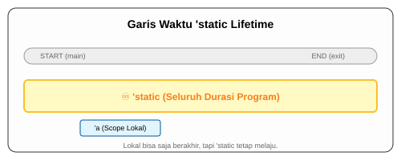

# CH-03_Static_Lifetime

> **"Kekal Hingga Akhir Hayat Program."**

Ada satu lifetime spesial yang berdiri di atas segalanya: `'static`. Ini adalah jaminan bahwa sebuah referensi akan selalu valid selama program masih berjalan.

---

## 🔍 Apa itu "'static" Lifetime?

**`'static`** adalah lifetime yang mencakup seluruh durasi eksekusi program. Semua string literal (seperti `"halo dunia"`) memiliki lifetime `'static` karena data mereka disimpan langsung di dalam biner program dan tidak pernah dihapus hingga program dimatikan.

---

## 🎭 Analogi: "Monumen Abadi"

### 1. Analogi Singkat (The Quick Snap)
`'static` seperti **Monumen Nasional (Monas)**. Selama negara (program) ini masih berdiri, Monas akan selalu ada di sana. Anda bisa membuat foto (referensi) Monas kapan saja, dan fotonya tidak akan pernah menjadi *dangling* karena subjeknya tidak akan pernah "pindah rumah" atau "di-drop".

### 2. Analogi Panjang (The Deep Dive)
Bayangkan sebuah **Perpustakaan Kota (Program)**.

1.  **Buku Pinjaman (Lifetime 'a)**: Anda meminjam buku dari anggota lain. Buku itu bisa dikembalikan atau ditarik kapan saja. Anda harus hati-hati menggunakannya.
2.  **Prasasti di Dinding ('static)**: Ada sebuah tulisan yang dipahat di batu di lobi perpustakaan. 
3.  **Sifat**: Tulisan di batu itu tidak bisa dipindahkan, tidak bisa dihapus, dan sudah ada di sana sejak perpustakaan dibuka hingga nanti ditutup. 
4.  **Akses**: Siapa pun boleh membuat referensi (melihat) ke prasasti tersebut dari lantai berapa pun, di jam berapa pun, tanpa takut tulisannya tiba-tiba hilang. Itulah `'static`.

---

## 💻 Contoh Kode: Keabadian String Literal

```rust
fn main() {
    // s1 memiliki tipe &'static str secara implisit
    let s1: &'static str = "Saya adalah abadi.";

    println!("{}", s1);
}

// Terkadang kita butuh memaksa lifetime 'static untuk 
// referensi yang harus hidup sangat lama (misal: Global Variable)
```

---

## 🗺️ Visualisasi: Garis Waktu Program



---
> [!CAUTION]
> **Jangan Asal Gunakan**: Pemula sering tergoda menggunakan `'static` untuk menghindari error lifetime. Namun, `'static` biasanya hanya untuk data yang benar-benar konstan. Memaksakan data dinamis menjadi `'static` biasanya membutuhkan `Box::leak` atau `Unsafe` yang bisa berbahaya jika tidak dipahami.

---
*Kembali ke [Buku](../README.md)*
