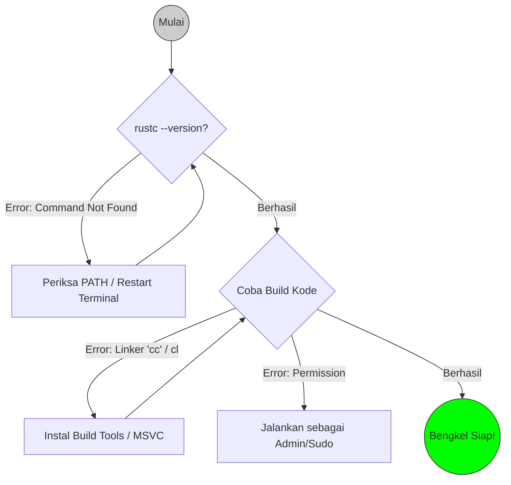

# CH-02_Troubleshooting

> **"Saat Bengkel Mengalami Kendala Teknis."**

Membangun bengkel Rust pertama kali tidak selalu mulus. Terkadang, alat-alat pendukung (seperti Linker atau Library sistem) tidak sinkron. Bab ini adalah panduan P3K Anda untuk mengatasi hambatan paling umum saat memulai.

---

## 🔍 Apa itu "Local Documentation"?

**Dokumentasi Lokal** adalah salinan lengkap seluruh ilmu pengetahuan Rust yang disimpan langsung di hard drive Anda. Ini memastikan bahwa meskipun Anda berada di tempat tanpa sinyal internet, Anda tetap memiliki akses ke petunjuk teknis, buku panduan, dan referensi fungsi Rust yang paling mutakhir.

---

## 🎭 Analogi: "Kunci Inggris yang Macet"

### 1. Analogi Singkat (The Quick Snap)
Membayangkan kendala instalasi seperti membeli rak buku baru namun ternyata **obeng** di rumah Anda tidak pas ukurannya. Masalahnya bukan pada raknya, tapi pada **alat penyambungnya** (*Linker*).

### 2. Analogi Panjang (The Deep Dive)
Bayangkan Anda sudah membeli set meja kayu yang indah dari toko (Rust). Anda membawa pulang instruksi dan kayunya. Namun, saat ingin menyatukan kaki meja dengan alasnya, Anda menyadari bahwa Anda tidak memiliki **semen** atau **baut** (*Linker*) untuk merekatkannya. 

Toko Rust menyediakan "kayu" dan "desain" yang sempurna, tetapi mereka mengandalkan "toko lokal" (Sistem Operasi Anda) untuk menyediakan alat perekatnya. Jika toko lokal belum menyediakan *C++ Build Tools* atau *Glibc*, meja Anda tidak akan pernah berdiri tegak. Troubleshooting adalah proses memastikan "perekat" ini tersedia dan siap digunakan.

---

## 🔍 Masalah Umum & Solusi

### 1. Pesan Error: "Linker 'cc' not found"
Ini adalah masalah paling populer bagi pengguna Linux/macOS.
- **Penyebab**: Rust bisa menulis kode, tapi butuh pembungkus akhir (Linker) dari sistem C.
- **Solusi (Ubuntu/Debian)**: `sudo apt install build-essential`.

### 2. Pesan Error: "Visual Studio is required"
Spesifik untuk pengguna Windows.
- **Penyebab**: Rust membutuhkan *Linker* dari Microsoft C++.
- **Solusi**: Instal **Visual Studio Build Tools** dan pastikan mencentang opsi "C++ build tools".

### 3. Perintah `rustc` Tidak Dikenali
- **Penyebab**: Alamat bengkel (*PATH*) belum terdaftar di peta sistem Anda.
- **Solusi**: Jalankan `source $HOME/.cargo/env` (Linux/Mac) atau restart terminal (Windows).

---

## 🧪 Verifikasi Diagnostik
Gunakan skrip di folder `examples/` untuk mengecek apakah sistem Anda sudah memiliki "perekat" yang cukup.

---

## 🗺️ Visualisasi: Pohon Keputusan Troubleshooting

---
> [!IMPORTANT]
> **Kaidah Istilah**: Jangan tertukar antara **Compiler** (penerjemah kode) dan **Linker** (penyambung kode menjadi aplikasi). Rust adalah Compiler, tapi ia butuh Linker pihak ketiga.

---
*Kembali ke [Buku](../README.md)*
