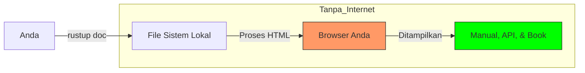

# CH-04_Local_Documentation

> **"Membawa Seluruh Perpustakaan ke Hutan Belantara."**

Salah satu fitur paling luar biasa dari Rust adalah ia menyertakan seluruh dokumentasi teknisnya secara lokal saat Anda menginstalnya. Anda tidak perlu internet untuk menjadi ahli Rust.

---

## 🎭 Analogi: "Buku Manual di Dalam Peti"

### 1. Analogi Singkat (The Quick Snap)
Dokumentasi lokal seperti fitur **"Offline Maps"** di Google Maps. Anda mengunduh petanya di rumah agar tetap bisa navigasi saat mendaki gunung tanpa sinyal.

### 2. Analogi Panjang (The Deep Dive)
Bayangkan Anda adalah seorang penjelajah yang sedang membangun kapal di pulau terpencil. Anda memiliki asisten setia bernama **`rustup`**. Hebatnya, `rustup` tidak hanya membawa alat pertukangan, tapi dia juga membawakan Anda sebuah **peti kayu raksasa** yang berisi ensiklopedia lengkap tentang cara membuat setiap bagian kapal, dari kemudi hingga layar.

Setiap kali Anda bingung bagaimana cara menyambung kayu mahoni, Anda tidak perlu mengirim merpati pos ke kota (Internet). Anda cukup meminta `rustup` untuk membukakan peti manual tersebut (`rustup doc`), dan seketika buku manual yang tepat akan terbuka di hadapan Anda. Anda bisa belajar dan bekerja dalam kesunyian hutan tanpa terganggu dunia luar.

---

## 📖 Cara Mengakses Dokumentasi Offline

### 1. Perintah Sakti
Buka terminal Anda dan ketik:
```bash
rustup doc
```
Perintah ini akan secara otomatis membuka browser Anda dan menampilkan halaman utama dokumentasi Rust yang tersimpan di hard drive Anda.

### 2. Mencari Library Spesifik
Jika Anda ingin melihat dokumentasi fungsi-fungsi standar (Standard Library):
```bash
rustup doc --std
```

---

## 🗺️ Visualisasi: Alur Akses Offline



---
> [!TIP]
> **Pro-Tip**: Dokumentasi ini juga mencakup *The Rust Book* versi offline. Sangat berguna untuk dibaca saat Anda sedang dalam perjalanan tanpa Wi-Fi!

---
*Kembali ke [Buku](../README.md)*
