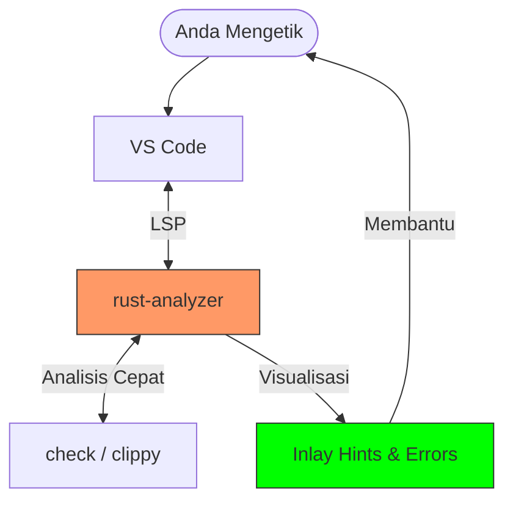

# CH-05_IDE_Tooling

> **"Mengenakan Kacamata Pintar di Dunia Rust."**

Menulis kode Rust tanpa bantuan IDE yang tepat seperti mencoba membidik sasaran dalam kegelapan. Rust adalah bahasa yang sangat cerdas, dan ia memiliki alat yang memungkinkan kecerdasan itu berpindah langsung ke jemari Anda melalui Editor.

---

## 🎭 Analogi: "Helm HUD Iron Man"

### 1. Analogi Singkat (The Quick Snap)
Menggunakan IDE dengan **`rust-analyzer`** seperti mengenakan **Kacamata Pintar** yang langsung menunjukkan di mana letak kesalahan ejaan atau logika bahkan sebelum Anda selesai menulis kalimatnya.

### 2. Analogi Panjang (The Deep Dive)
Bayangkan Anda adalah seorang pilot pesawat tempur canggih. Anda bisa saja menerbangkan pesawat hanya dengan melihat ke luar jendela, tetapi itu sangat berisiko. 

**`rust-analyzer`** adalah sistem **HUD (Heads-Up Display)** di dalam helm Anda. Saat Anda melihat ke arah tombol (*Fungsi*), HUD memberikan informasi teknis tentang tombol tersebut. Saat radar mendeteksi adanya kegagalan mesin di depan (*Error Code*), HUD akan memberi peringatan merah di depan mata Anda dan memberikan saran perbaikan secara instan. 

Tanpa HUD ini, Anda harus terus-menerus membuka buku manual (*Dokumentasi*) dan menebak-nebak kondisi pesawat. Dengan HUD, Anda dan pesawat (Compiler) menjadi satu kesatuan yang sinkron dan efisien.

---

## 🛠️ Persenjataan Utama: VS Code + rust-analyzer

### 1. Lingkungan Kerja: Visual Studio Code
VS Code adalah editor pilihan utama komunitas karena ringan dan memiliki dukungan ekstensi yang luar biasa untuk Rust.

### 2. Otak Editor: `rust-analyzer`
Ini adalah **Language Server Protocol (LSP)** yang melakukan analisis mendalam terhadap kode Anda secara real-time.
- **Auto-completion**: Menyarankan nama fungsi dan variabel.
- **Type Inlay Hints**: Menunjukkan tipe data secara visual meski Anda tidak menuliskannya.
- **Real-time Error**: Garis merah gelombang saat ada kesalahan sintaksis atau *Ownership*.

### 3. Asisten Kerapian: `rustfmt` & `clippy`
- **`rustfmt`**: Memastikan kode Anda selalu rapi sesuai standar komunitas (Kerapian Seragam).
- **`clippy`**: "Burung Kakatua" cerewet yang memberikan ribuan saran agar kode Anda lebih efisien dan *idiomatic*.

---

## 🗺️ Visualisasi: IDE Feedback Loop

---

## 🧪 Praktek: Kekuatan `rustfmt`
Lihat folder `examples/` untuk melihat bagaimana Rust secara otomatis merapikan "bengkel" Anda yang berantakan.

---
> [!IMPORTANT]
> **Kaidah Istilah**: Jangan tertukar! **VS Code** adalah "Editor"-nya (Wadah), sedangkan **`rust-analyzer`** adalah "LSP"-nya (Otaknya). Keduanya bekerja sama untuk memberikan pengalaman coding yang premium.

---
*Kembali ke [Buku](../README.md)*
