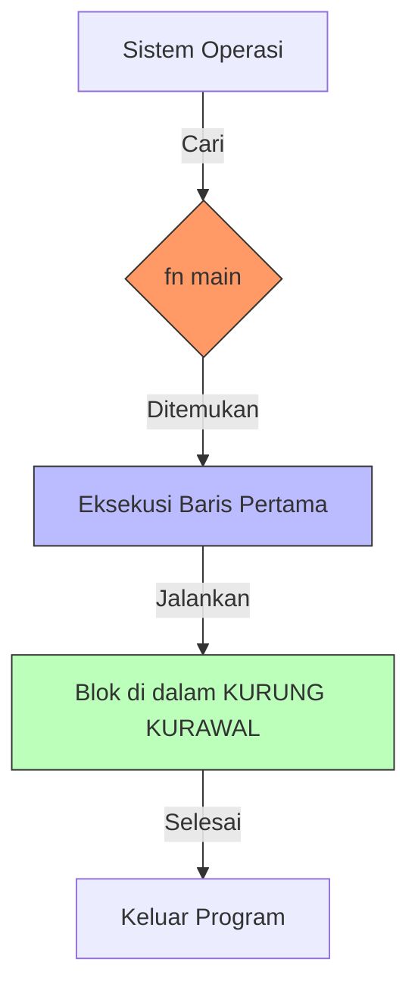

# CH-02_The_Entry_Point

> **"Menemukan Pintu Utama dalam Kegelapan."**

Setiap program yang bisa berjalan membutuhkan titik awal. Rust sangat disiplin tentang hal ini: Anda harus memiliki fungsi bernama `main`. Tanpanya, program Anda seperti mobil bagus tanpa kunci kontak—indah dilihat, tapi tidak bisa jalan.

---

## 🎭 Analogi: "Saklar Lampu Utama"

### 1. Analogi Singkat (The Quick Snap)
Fungsi `main` seperti **Saklar Utama** dalam sebuah gedung. Saat aliran listrik (Sistem Operasi) dinyalakan, kabel pertama yang akan dialiri arus adalah saklar ini. Jika saklarnya tidak ada, seluruh gedung tetap gelap.

### 2. Analogi Panjang (The Deep Dive)
Bayangkan Anda sedang membaca sebuah buku petunjuk teknis. Penulis buku tersebut harus memberikan instruksi yang jelas: *"Mulai baca dari sini"*. 

Dalam dunia Rust, **Sistem Operasi** adalah pembaca instruksi Anda. Dia datang ke file Anda dan mencari kata kunci **`fn main()`**. Kata `fn` memberitahu pembaca bahwa ini adalah sebuah "Aktivitas" atau "Fungsi". Nama `main` memberitahu bahwa ini adalah "Aktivitas Paling Utama".

Dan kurung kurawal **`{ }`**? Bayangkan itu sebagai **Pagar Pembatas** area kerja. Segala sesuatu di dalam pagar adalah tugas yang harus dilakukan. Selama belum keluar dari pagar penutup `}`, program akan terus bekerja di sana.

---

## 🔍 Anatomi Kode Minimal

```rust
fn main() {
    // Kode Anda akan ada di sini
}
```

- **`fn`**: Keyword untuk mendefinisikan fungsi (Fungsi = Sekumpulan Instruksi).
- **`main`**: Nama wajib untuk titik masuk aplikasi.
- **`()`**: Tempat untuk "bahan baku" (parameter). Pada tahap ini, kita biarkan kosong.
- **`{ }`**: Tubuh fungsi (Body). Semua logika diletakkan di antara dua kurung ini.

---

## 🗺️ Visualisasi: Peta Alur Entry Point



---
> [!IMPORTANT]
> **Kaidah Istilah**: Area di dalam `{ }` disebut sebagai **Function Body** atau **Scope**. Ingatlah, Rust sangat menghargai privasi dan batas-batas scope ini.

---
*Kembali ke [Buku](../README.md)*
