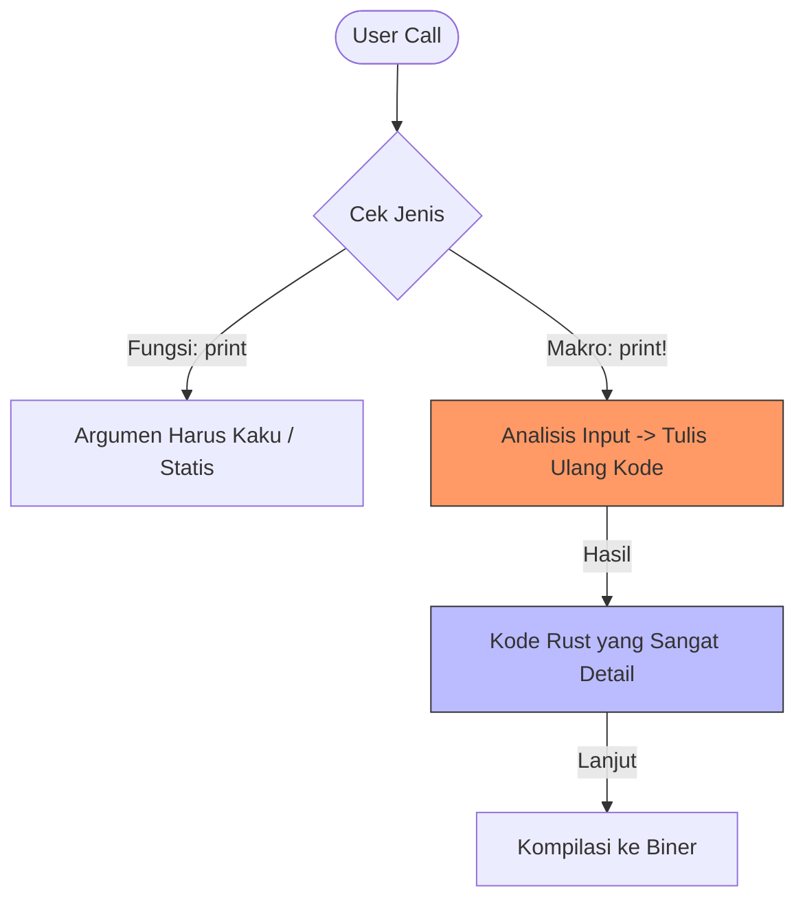

# CH-03_Macro_Introduction

> **"Kekuatan di Balik Tanda Seru."**

Mengapa `println!` memiliki tanda seru? Jika Anda datang dari bahasa lain, Anda mungkin menganggapnya sebagai fungsi biasa. Tapi di Rust, itu adalah sebuah **Makro**. Dan makro adalah cara Rust memberikan kekuatan super pada kode Anda.

---

## 🎭 Analogi: "Mesin Foto Copy Pintar"

### 1. Analogi Singkat (The Quick Snap)
Fungsi biasa seperti **Tugas Manual** (Anda menulis satu baris), sedangkan Makro seperti **Mesin Foto Copy** yang secara otomatis menuliskan beratus-ratus baris kode rumit untuk Anda hanya dengan menekan satu tombol `!`.

### 2. Analogi Panjang (The Deep Dive)
Bayangkan Anda ingin memesan pizza. 

Jika Anda menggunakan **Fungsi Biasa**, Anda harus menyebutkan daftar bahan yang kaku (misal: harus 3 bahan, tidak boleh lebih). Jika Anda berubah pikiran ingin 5 bahan, fungsinya akan error karena aturannya saklek.

**Makro (`!`)** seperti koki yang sangat fleksibel. Saat Anda memanggil `println!`, makro ini akan **melihat** apa yang Anda ketik, lalu dia akan **menulis ulang** kode sebenarnya yang sangat rumit di balik layar agar sesuai dengan keinginan Anda. Jika Anda ingin mencetak satu kata, dia menulis kode A. Jika Anda ingin mencetak sepuluh variabel, dia akan secara dinamis menulis kode B. Tanda seru `!` adalah sinyal bahwa: *"Hai Compiler, tolong kerjakan kode yang rumit untukku berdasarkan input ini!"*

---

## 🔍 Kenapa Harus Makro?

Alasan utama `println!` adalah makro:
1.  **Variadic Arguments**: Bisa menerima jumlah input yang berbeda-beda (tidak terbatas).
2.  **Compile-time Check**: Rust memeriksa *sebelum* program jalan apakah format teks Anda (misal: `{}`) cocok dengan variabel yang diberikan. Jika tidak cocok, program tidak akan mau dikompilasi.

---

## 🗺️ Visualisasi: Kerja Makro vs Fungsi

---
> [!IMPORTANT]
> **Kaidah Istilah**: Proses di mana makro "menulis ulang" kode disebut sebagai **Macro Expansion**. Ingat, tanda seru `!` berarti kode Anda sedang "meledak" menjadi sesuatu yang lebih besar di balik layar.

---
*Kembali ke [Buku](../README.md)*
