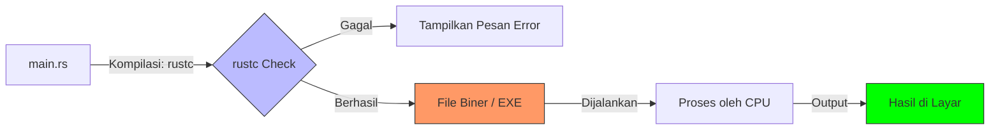

# CH-04_Manual_Compilation

> **"Dari Tulisan Menjadi Perbuatan."**

Setelah kita menulis kode, saatnya kita mengubahnya menjadi sesuatu yang bisa dijalankan oleh komputer. Kita akan menggunakan **`rustc`**, sang Compiler Rust yang asli dan murni.

---

## 🔍 Apa itu "Manual Compilation"?

**Kompilasi Manual** adalah proses menerjemahkan bahasa manusia (teks `.rs`) menjadi bahasa mesin secara langsung menggunakan Compiler. Ini adalah tahap "pembuktian" di mana ide-ide Anda diwujudkan menjadi file binari yang siap dikerjakan oleh prosesor komputer.

---

## 🔍 Apa itu "Syntax Conventions"?

**Konvensi Sintaksis** adalah kumpulan aturan "etiket" dan kebiasaan dalam penulisan kode. Tujuannya adalah agar kode tidak hanya bisa dibaca oleh mesin, tetapi juga mudah dimengerti, dirawat, dan dihormati oleh sesama manusia (developer lain) sesuai standar resmi komunitas Rust.

---

## 🎭 Analogi: "Aturan Lalu Lintas"

### 1. Analogi Singkat (The Quick Snap)
Menulis kode adalah **Menulis Resep** (File `.rs`). Menjalankan Compiler (`rustc`) adalah proses **Memasak** resep tersebut menjadi **Sajian Hidangan** (File Biner/Executable). Resep tidak bikin kenyang, masakanlah yang bisa dimakan.

### 2. Analogi Panjang (The Deep Dive)
Bayangkan Anda adalah seorang arsitek yang menggambar denah rumah di atas kertas biru. Denah itu indah, tapi Anda tidak bisa tinggal di dalamnya. Anda membutuhkan **Kontraktor** yang bisa membaca denah tersebut dan membangun struktur fisiknya dengan batu bata dan semen.

**`rustc`** adalah kontraktor tersebut. Dia membaca file teks Anda (`main.rs`), memeriksa apakah strukturnya kokoh (Memory Safety), lalu dia membangun sebuah **Gedung Fisik** (File `.exe` atau binari). 

Gedung ini sekarang berdiri sendiri. Anda bisa merobohkan kertas birunya (menghapus file `.rs`), tapi gedung fisiknya tetap bisa dimasuki (dijalankan). Hebatnya lagi, kontraktor Rust sangat cerewet; jika dia melihat ada tiang yang rapuh, dia akan mogok kerja sampai Anda memperbaikinya.

---

## 🛠️ Langkah Eksekusi Manual

### 1. Kompilasi
Buka terminal di folder proyek Anda dan jalankan perintah:
```bash
rustc main.rs
```

### 2. Periksa Hasilnya
Jika berhasil, Anda akan melihat file baru di folder Anda:
- **Windows**: `main.exe` dan `main.pdb`.
- **Linux/macOS**: `main`.

### 3. Jalankan Program
Ketik nama file biner tersebut untuk menjalankannya:
```bash
./main
```

---

## 🗺️ Visualisasi: Alur Transformasi Biner



---
> [!IMPORTANT]
> **Kaidah Istilah**: File hasil kompilasi disebut sebagai **Executable Binary**. Berbeda dengan bahasa yang butuh interpreter (seperti Python), Rust menghasilkan file yang mandiri dan sangat cepat.

---
*Kembali ke [Buku](../README.md)*
